# IronBook — Distributed Benchmarking & Hosting Platform
## Design Specification

| Field | Value |
|---|---|
| **Status** | Complete — all 9 sections approved; pending user review |
| **Author** | Kartik Mehra (solo) |
| **Hackathon** | IICPC Summer Hackathon 2026 (May 9 → June 10, 2026) |
| **Created** | 2026-05-10 |
| **Repo** | github.com/<owner>/IronBook |
| **Codename** | IronBook (order book + iron-clad correctness) |

---

## 0. Context

### 0.1 Problem statement (from organizer brief)

Architect and build a **Distributed Benchmarking and Hosting Platform** that evaluates contestant-submitted trading infrastructure (matching engines, order books, exchange APIs) written in C++, Rust, or Go. The platform must:

1. Accept code uploads.
2. Securely host submissions in isolated sandboxes with CPU pinning and strict memory limits.
3. Expose REST / WebSocket / FIX endpoints from each submission.
4. Spawn a distributed fleet of trading bots that bombard each submission with concurrent orders.
5. Capture latency (p50/p90/p99), throughput (TPS), and correctness (price-time priority, fill accuracy).
6. Stream live results to a dynamic leaderboard.

The judges have explicitly endorsed: **gRPC, Kafka/Redpanda, TimescaleDB/Redis, Terraform, Kubernetes manifests/Docker Swarm**. Deviations from these must be defended in this document.

Three deliverables, equal weight:

1. Working infrastructure prototype (Code Upload → Containerized Deployment → Distributed Load Testing → Real-Time Scoring).
2. **This document** (Architecture Blueprint).
3. Infrastructure as Code (Terraform + Kubernetes manifests).

### 0.2 Constraints

| Constraint | Value | Implication |
|---|---|---|
| Workforce | 1 person, beginner-to-intermediate | Pick fewer technologies, go deep |
| Calendar | 31 days (May 10 → June 10) | 25-day build + 6-day submission buffer |
| AI assistance | First 12 days only | Architectural climax must land by Day 12 |
| Hardware | macOS M3 Pro (ARM64) | No KVM → Firecracker out → gVisor in |
| Cloud budget | ~€10–50 / month | Single Hetzner CCX13 ARM VM |
| Submission format | Repo + working prototype + this doc + IaC | Reproducibility matters |

### 0.3 Strict priority order

1. **Correctness** — price-time priority, fill consistency, deterministic replay
2. **Throughput** — orders per second sustained
3. **Realistic exchange behavior** — order types, market regimes, FIX semantics

### 0.4 Final stack decisions

| Layer | Choice | Rationale (one-liner; full justification in §3 / §10) |
|---|---|---|
| Sandbox runtime | gVisor (runsc) + seccomp + AppArmor + cgroups v2 | KVM unavailable on Mac dev path; gVisor is production-grade (Cloud Run / App Engine) |
| Orchestration | k3d (Mac) + k3s (Hetzner) connected by Wireguard | Real K8s, two clusters, ~€10/mo total |
| CRDs | `Submission`, `Scenario`, `BenchmarkRun`, `BotSwarm` (kubebuilder) | Distinct lifecycles; teaches the K8s extension model |
| Hot path | Rust (matching-engine ref, telemetry-ingester, eBPF probes via `aya`) | Lock-free queueing, zero-cost abstractions |
| Control plane | Go (operator, gateway, fleet, validators) | K8s ergonomics, fastest learning curve |
| Streaming | Redpanda (Kafka API, single binary, tiered storage to MinIO) | No JVM, no Zookeeper, simpler ops |
| Time-series | ClickHouse (MergeTree + materialized views) | Faster ingestion than Timescale, friendlier SQL for histograms |
| Metadata | Postgres | Standard relational |
| Cache + leaderboard | Redis (sorted sets) | ZADD/ZRANGE for live ranking |
| Artifacts | MinIO (S3-compatible, content-addressed) | Replay logs, source archives, signed manifests |
| RPC | gRPC + Protobuf | IDL-driven, codegen for both Go and Rust |
| Wire to UI | gRPC-Web (control) + SSE (leaderboard delta stream) | SSE is lighter than WS for one-way fan-out |
| Frontend | Next.js 15 (App Router) + shadcn/ui + uPlot + TanStack Query | Modern React, real-time data viz |
| Observability | OpenTelemetry → Tempo + Loki + Prometheus + Grafana + Parca | Full o11y stack, eBPF profiling |
| IaC | Terraform (Hetzner + Cloudflare) + raw K8s manifests + Kustomize | Helm only after the abstraction earns its keep |
| GitOps | Argo CD watching `./deploy/manifests` | Real GitOps, big resume signal |
| CI/CD | GitHub Actions + Cosign image signing + Trivy + SLSA-3 attestations | Supply-chain hygiene |
| Admission | OPA Gatekeeper + custom admission-webhook | Two layers, distinct roles |

---

## 1. System Topology — APPROVED

A two-region architecture. Region A (Mac) is the **Control & Insight Plane**: stateful services, orchestration, observability, frontend. Region B (Hetzner) is the **Sandbox & Hot Path**: untrusted code execution, bot fleet, reference oracle, fairness gateway. Wireguard connects them; **the order hot path never crosses Wireguard**.

### 1.1 Architectural principles

1. **The hot path lives in one cluster.** A bot's order, the gateway's stamp, the submission's reply, the oracle's parallel reply — all intra-cluster in Region B. Cross-region latency would distort the very numbers we publish.
2. **Correctness is a stream-processing problem.** The reference oracle consumes the same deterministic input as the submission, in parallel; a divergence detector compares output tuple-by-tuple. The leaderboard surfaces correctness live, not in batch.
3. **Determinism comes from outside the submission.** Platform-issued monotonic timestamps + sequence numbers eliminate the "fast clock" attack and make scoring fair across hardware.
4. **Every component earns its keep.** Each box on the diagram has a load-bearing reason that is articulated in §3. No vanity services.

### 1.2 Topology diagram

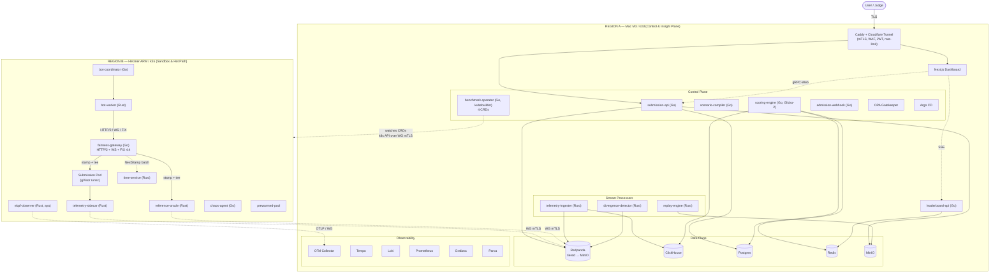

### 1.3 What every new piece earns its keep

- **fairness-gateway** — stamps every order with a platform-issued `(platform_seq, platform_ts)`, strips bot identity, and **tees** every input to the reference oracle. One service, three load-bearing jobs.
- **reference-oracle** — your Rust matching engine running in parallel with the submission, fed the *exact same* gateway-stamped inputs. Its output is the ground truth.
- **time-service** — kills the "fast clock" attack. ~150 lines of Rust; pedagogical excuse to learn TSC, chrony, and exchange-grade timestamping.
- **prewarmed-pool** — cold-start jitter (200–500 ms) eats published p99 numbers. Four idle gVisor pods, swap in on `BenchmarkRun` create.
- **scenario-compiler + content-addressed scenarios** — every YAML scenario compiles to a deterministic event schedule with a seeded PRNG; the schedule is sha256-hashed; that hash is the scenario ID. Two runs with the same scenario ID get bit-identical input — that is what makes ranking comparable.
- **MinIO + Parquet replay logs** — every run captures its full input as a Parquet file, content-addressed. `replay-engine` re-emits any historical input against any submission. HFT-grade and rare in hackathons.
- **Redpanda tiered storage** — single broker, infinite retention via cold-segment offload to MinIO.
- **KEDA on Redpanda lag** — bot-fleet autoscales on `orders` topic consumer lag. Canonical "real distributed autoscaling" lesson.
- **OPA Gatekeeper + admission-webhook** — Gatekeeper for boring policies (no `:latest`, no privileged, no `hostPath`). Webhook for the interesting policy (every submission pod must use `runtimeClassName: gvisor`, must mount the readonly seccomp profile, must declare its CRD owner).
- **Argo CD** — `./deploy/manifests` is the source of truth. Day-to-day deploy = `git push`.
- **Glicko-2 scoring** — multi-scenario tournaments with rating ± deviation, not single-run-wins.
- **chaos-agent** — judge clicks "Inject Network Loss" → packet loss spikes → leaderboard shows resilient submissions stay green. Live theater, technically real.

### 1.4 Cross-region wire — what crosses, what doesn't

| Crosses Wireguard | Stays intra-cluster (Region B) |
|---|---|
| Telemetry batches (B → A Redpanda, ~5s aggregate) | **All order flow** (bot → gateway → submission) |
| OTel traces / metrics / logs (B → A collector) | Reference oracle parallel feed |
| Operator → k3s API control (A → B, mTLS over WG) | Divergence detection inputs |
| Argo CD reconcile poll (A → B git mirror) | eBPF observation stream |

### 1.5 Deliberately *not* in the topology

- **Service mesh (Istio / Linkerd).** ~12 services across 2 nodes; mesh overhead exceeds benefit. mTLS via cert-manager directly on each gRPC server.
- **Multi-cloud failover.** Documented as future work in §10.
- **Kafka.** Redpanda is API-compatible, single binary, no JVM, no Zookeeper.
- **A separate scheduler service.** The benchmark-operator *is* the scheduler. Adding another would be Conway's-Law cosplay.
- **WASM execution mode.** Mentioned as a runtime-class plug-point; not implemented.

---

## 2. Data Flow & Order Lifecycle — APPROVED

Five distinct flows. Each one self-contained: trigger, path, timing, invariants. Violating any invariant means the platform is *wrong*, not just slow.

### 2.1 Flow 1 — Submission upload (cold path)

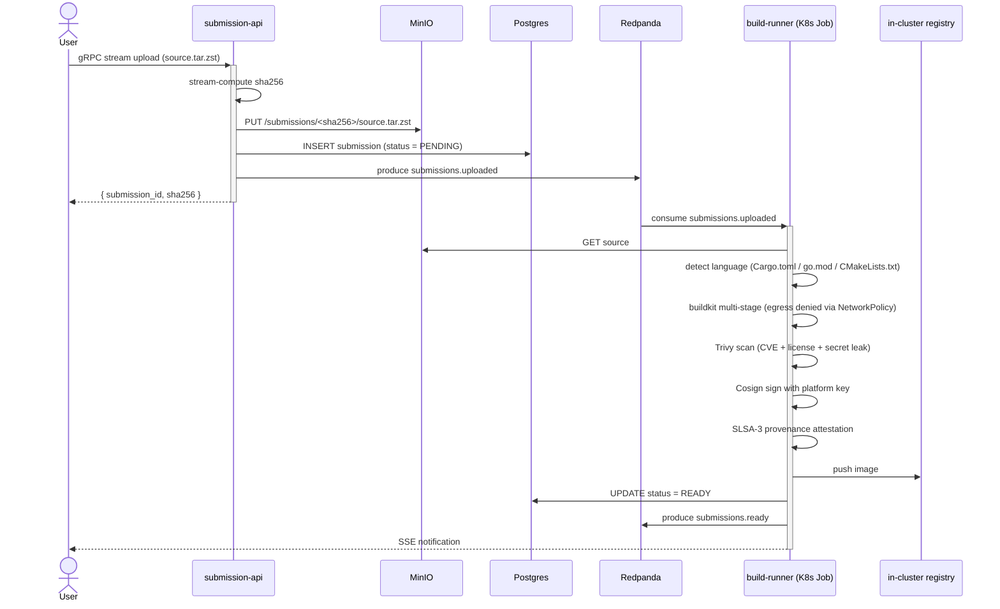

**Invariants**

- Source artifact is content-addressed by sha256; identical uploads dedupe automatically.
- A submission can only transition `PENDING → BUILDING → READY` or `→ REJECTED`. No reverse transitions.
- Build runs in namespace `builds/` with NetworkPolicy denying all egress except the in-cluster registry. Hostile build-time code cannot phone home.
- An unsigned image is never schedulable. The admission-webhook checks the cosign signature on every pod create.

**Timing budget:** end-to-end upload-to-ready ≤ 90 s for typical Rust, ≤ 30 s for Go. Per-language buildkit cache lives on its own PV, persisted across runs.

### 2.2 Flow 2 — BenchmarkRun lifecycle (control path)

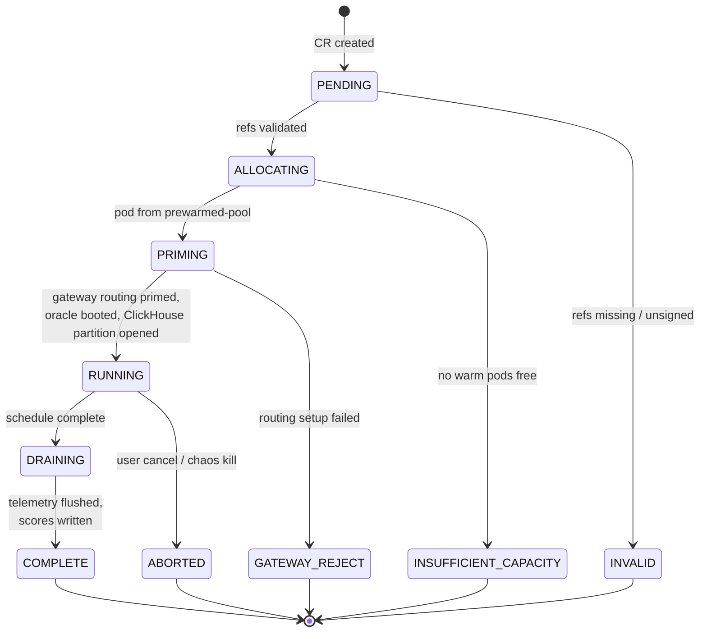

**Reconciler steps (RUNNING entry):**

1. Allocate a hot pod from `prewarmed-pool` (binary swap via `emptyDir` mount + container restart).
2. Issue ephemeral mTLS certs via cert-manager `Certificate` CR per run.
3. Configure `fairness-gateway` routing: `{ run_id → submission_endpoint, oracle_endpoint }`.
4. Boot reference-oracle pod with same `(scenario_hash, seed)`.
5. Compile scenario YAML → event schedule → push to bot-coordinator.
6. Open ClickHouse partition for this `run_id`.
7. Set `Status: RUNNING`; emit `run.started` event to Redpanda.

**Invariants**

- The fairness-gateway is primed *before* the first bot order is emitted. Orders arriving without a routing rule are rejected and counted.
- Oracle and submission boot from the same `(scenario_hash, seed)` — guaranteed identical input.
- Hot pods in the pre-warm pool already have the gVisor sandbox initialized; only the contestant binary is swapped. Cold start drops from ~400 ms to ~30 ms.

**Timing budget:** `BenchmarkRun.create → status = RUNNING` ≤ 800 ms (warm pod), ≤ 4 s (cold).

### 2.3 Flow 3 — Order hot path (latency-scored)

This is the path every published p50/p99 number is measured along. **Lives entirely intra-cluster in Region B. Never crosses Wireguard.**

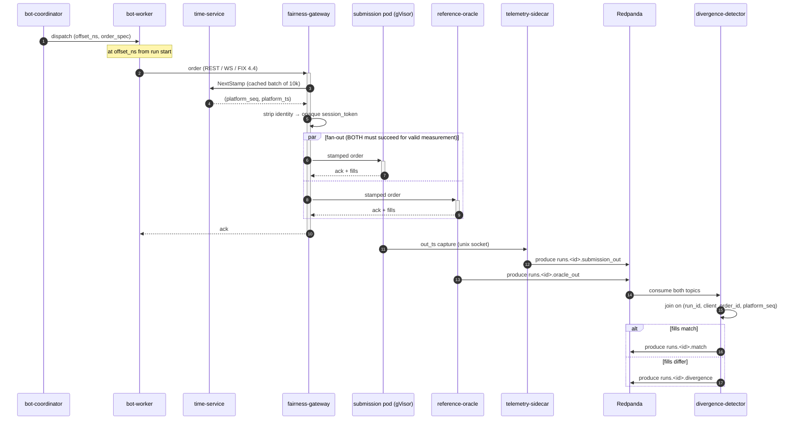

**Invariants — checked, not assumed**

1. **Strict monotonicity of `platform_seq`** within a run. Any gap = error logged, run flagged.
2. **Every input is teed to both consumers.** The gateway maintains a per-run counter. If `submission_in_count ≠ oracle_in_count`, the run is invalidated.
3. **`client_order_id` is unique within a bot.** Coordinator generates them; gateway rejects duplicates.
4. **Reference oracle output is ground truth.** If oracle and submission disagree on fills for the same input, the submission is wrong by definition.
5. **Latency is measured at the gateway.** `latency_ns = t_ack_at_gateway − t_in_at_gateway`. The submission cannot fake low latency by lying about its own clock.

**Timing budget (published on the leaderboard)**

| Hop | Native | Under gVisor | Notes |
|---|---|---|---|
| bot-worker → gateway | 30–80 µs | n/a | bot-worker runs native |
| gateway stamp + fork | 10–30 µs | n/a | single Go alloc; sync.Pool reuse |
| gateway → submission (gVisor) | 50–150 µs | gVisor adds ~30 µs syscall overhead | published as part of submission's number |
| submission engine work | depends | depends | this is what the contestant is graded on |
| submission ack → telemetry-sidecar | 5–20 µs | n/a | unix socket; sidecar is native |
| telemetry → Redpanda | 100 ms batch | n/a | does NOT count toward order latency |
| divergence detection | ≤ 1 s lag | n/a | consumer lag, not order lag |

A submission processing simple limit orders in ~5 µs of engine work, served via WS, ought to land around **p50 ≈ 90 µs, p99 ≈ 250 µs** on this platform.

### 2.4 Flow 4 — Telemetry to leaderboard

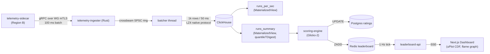

**Invariants**

- The hot order path **never blocks** on telemetry. Sidecar's send queue has bounded capacity; on overflow it drops *and increments a counter*. We measure what we miss.
- ClickHouse inserts are at-least-once; idempotency comes from `(run_id, platform_seq)` as the dedup key.
- Leaderboard cadence is decoupled from telemetry cadence. ClickHouse can lag 200 ms without anyone noticing; the leaderboard ticks at 1 Hz independently.

### 2.5 Flow 5 — Deterministic replay

```mermaid
sequenceDiagram
    actor Judge
    participant API as submission-api
    participant Op as benchmark-operator
    participant Rep as replay-engine
    participant MN as MinIO
    participant GW as fairness-gateway
    participant Sub as new submission pod
    participant Or as reference-oracle

    Judge->>API: replay run R against submission Y
    API->>Op: create BenchmarkRun (replay_source = R_hash)
    Op->>Rep: prepare replay job
    Rep->>MN: GET parquet replay log
    Op->>Op: boot pods (sub + oracle), prime gateway
    Rep->>GW: re-emit orders (preserve original platform_seq, platform_ts)
    GW->>Sub: stamped order
    GW->>Or: stamped order
    Note over Sub,Or: identical input as the original run
    Sub-->>GW: ack + fills (NEW output)
    Or-->>GW: ack + fills (recomputed; should match original oracle)
    Note over Rep: scoring is comparable to original run
```

**Invariants**

- Replay never calls `time-service` for new stamps; it preserves the original `(platform_seq, platform_ts)` from the recorded log. This is what makes A-vs-B fair.
- A replay log is content-addressed by sha256 of its serialized event stream.
- A self-replay (same submission image sha256 against the log it was recorded with) **must** produce byte-identical output. CI asserts this as a smoke test.

### 2.6 Out-of-scope flows

- **Saga / compensating transactions** for `BenchmarkRun` failures. Operator deletes the CR and frees the pod. No external side effects yet.
- **Exactly-once Redpanda semantics.** Idempotent producers + consumer-side dedup keys are sufficient.
- **Distributed transactions across Postgres + ClickHouse.** Postgres holds metadata; ClickHouse holds time-series. They are never updated atomically; run metadata flips to `COMPLETE` only after final telemetry batch flush is confirmed.

---

## 3. Component Specifications — APPROVED

### 3.1 Service inventory

| # | Service | Lang | Region | LoC est. | Watches CRD | Stateless | Why it exists |
|---|---|---|---|---|---|---|---|
| 1 | `submission-api` | Go | A | ~1.5k | Submission (writer) | Yes | Authenticated upload, content-addressed, multipart→MinIO |
| 2 | `benchmark-operator` | Go (kubebuilder) | A | ~2.5k | All 4 | Yes | The brain: reconciles BenchmarkRun → pods + routing |
| 3 | `scenario-compiler` | Go | A | ~600 | Scenario | Yes | YAML DSL → seeded deterministic event schedule |
| 4 | `scoring-engine` | Go | A | ~700 | — | Yes | Glicko-2 across scenarios, composite score |
| 5 | `admission-webhook` | Go | A | ~400 | — | Yes | Enforces gVisor + read-only + dropped caps on every pod |
| 6 | `build-runner` | Go (Job) | A | ~800 | Submission (builder) | Per-job | Sandboxed buildkit + Trivy + Cosign + SLSA |
| 7 | `telemetry-ingester` | Rust | A | ~900 | — | Yes | Lock-free SPSC → ClickHouse batch insert |
| 8 | `divergence-detector` | Rust | A | ~700 | — | Kafka-checkpointed | Joins oracle vs submission output |
| 9 | `replay-engine` | Rust | A | ~600 | — | Yes | Parquet → re-emit orders against any sandbox |
| 10 | `leaderboard-api` | Go | A | ~600 | — | Yes | 1 Hz Redis ZRANGE → SSE |
| 11 | Frontend | TS / Next.js | A | ~3k | — | n/a | Live leaderboard, latency CDF, flame graphs |
| 12 | `fairness-gateway` | Go | B | ~700 | — | Yes | Stamps platform_seq, strips identity, tees to oracle |
| 13 | `reference-oracle` | Rust | B | ~2k | — | Per-run | The matching engine; ground truth |
| 14 | `bot-coordinator` | Go | B | ~600 | BotSwarm | Per-run | Reads schedule, dispatches events |
| 15 | `bot-worker` | Rust | B | ~900 | — | HPA-scaled | REST/WS/FIX clients |
| 16 | `telemetry-sidecar` | Rust | B | ~500 | — | Per-pod | Captures (in_ts, out_ts, order, ack, fills) |
| 17 | `time-service` | Rust | B | ~250 | — | Yes | Monotonic ns, chrony-corrected |
| 18 | `ebpf-observer` | Rust (aya) | B | ~400 | — | DaemonSet | Per-cgroup syscalls / CPU / net |
| 19 | `chaos-agent` | Go | B | ~300 | — | Yes | Pod kill, tc netem, cgroup CPU throttle |

**Totals:** ~17k LoC; ~4k Rust, the rest Go + TS.

**Shared crates / packages**

- `crates/matching-engine` (Rust) — order book + matcher, used by `reference-oracle` and as the publishable contestant template
- `crates/replay-format` (Rust) — Parquet schema + (de)serializer
- `crates/proto` (Rust) — generated prost + tonic bindings; `pkg/proto` (Go) — generated protoc-gen-go bindings (both produced from `proto/` IDL via `buf generate`)
- `pkg/k8s-client` (Go) — thin wrapper on client-go
- `pkg/cosign-verify` (Go) — cosign sig verification

### 3.2 Custom Resource model

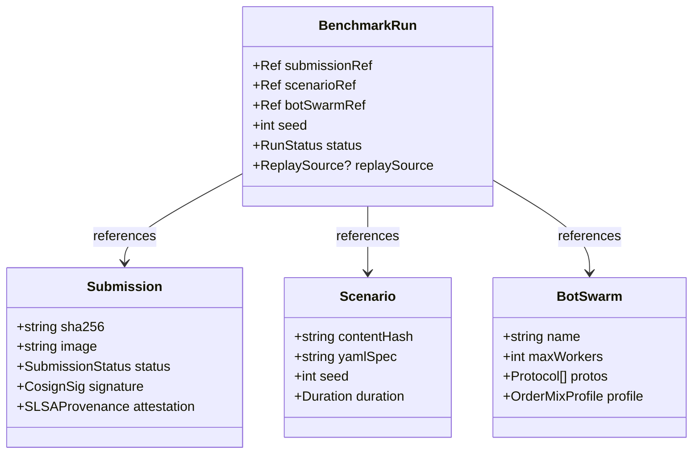

### 3.3 Deep-dive: `benchmark-operator`

Reconciles 4 CRDs. Built with `kubebuilder` v4. Single binary, leader-elected (1 active + 2 standby on a 3-node k3d cluster).

```
controllers/
  submission_controller.go     # PENDING → BUILDING → READY
  scenario_controller.go       # validate + content-address scenario YAML
  bot_swarm_controller.go      # provision a named, reusable bot fleet config
  benchmark_run_controller.go  # the main reconciler (most complex)
```

`BenchmarkRunReconciler.Reconcile()` is the state machine in §2.2. Each transition is idempotent — operator can restart mid-reconcile and resume. `kubectl describe BenchmarkRun` surfaces status conditions; a judge running `kubectl get br -w` sees the state machine update live.

**Critical invariants**

- Operator never creates a pod without a corresponding `Submission` in `READY` status.
- Operator never marks `COMPLETE` until `telemetry-ingester` confirms final batch flush via Redpanda topic `runs.<id>.flushed`.
- Operator owns the lifecycle of run-scoped TLS certs (cert-manager `Certificate` CR per run).
- `OwnerReferences` cascade: deleting a `BenchmarkRun` garbage-collects its pods, certs, and ClickHouse partition.

### 3.4 Deep-dive: `fairness-gateway`

Stateless Go gRPC + HTTP/2 + WebSocket + FIX 4.4 proxy. All four wire formats normalize internally to a `NormalizedOrder` proto.

```go
// Hot-path pseudocode
func (g *Gateway) HandleOrder(ctx context.Context, raw []byte, proto Protocol) error {
    order := decode(raw, proto)                      // ~200 ns
    seq, ts := g.timeClient.NextStamp()              // ~5 µs (cached batch)
    order.PlatformSeq = seq
    order.PlatformTs = ts
    order.SessionToken = g.opaqueToken(order.BotID)  // strip identity

    // FAN-OUT (key correctness invariant)
    err1 := g.submissionConn.SendAsync(order)        // gVisor pod
    err2 := g.oracleConn.SendAsync(order)            // native pod
    if err1 != nil || err2 != nil {
        return fmt.Errorf("tee failed: %w / %w", err1, err2)
    }

    g.sidecarHook.OnIn(order)                        // unix socket → sidecar
    return nil
}
```

**Critical design choices**

- Single allocation per request (`sync.Pool` for `NormalizedOrder`, decoder reuse).
- `time-service` calls are **batched**: the gateway fetches 10,000 stamps at a time and serves them locally, amortizing the RPC.
- Fan-out is fire-and-forget at the wire level, but ack is awaited from *both* targets before the bot sees a response. This is what makes "oracle disagreed = run invalid" honest.

### 3.5 Deep-dive: `reference-oracle`

A real Rust matching engine. The single most valuable artefact you build the whole hackathon — it teaches order books, lock-free structures, async Rust, property-based testing, and gives you the correctness oracle that makes the platform credible.

```
crates/matching-engine/
  src/
    book.rs           # OrderBook: BTreeMap<Price, VecDeque<Order>> per side
    match.rs          # price-time priority matcher → Vec<Fill>
    types.rs          # Order, Fill, Side, OrderType, TimeInForce
    sequence.rs       # monotonic event log
    snapshot.rs       # deterministic serialization (replay support)
  tests/
    proptest.rs       # property: any order sequence → consistent fills
    examples.rs       # hand-written scenarios from real exchange patterns
  benches/
    throughput.rs     # criterion bench, target: 1M orders/sec single-thread
```

**Properties checked with `proptest`**

1. **No-free-lunch:** total quantity in fills = total matched quantity on both sides.
2. **Price-time priority:** for any fill at price P from side `Bid`, no resting `Ask` at price ≤ P with earlier `platform_seq` was unfilled before it.
3. **Idempotency:** applying the same `(platform_seq, order)` twice produces the same book state.
4. **Determinism:** serialize the book, deserialize, reapply remaining events → identical state.

Wire layer: oracle pod wraps the engine in a thin gRPC server mirroring the submission's expected API. Same protocol, same wire format — so the fairness-gateway treats them identically.

### 3.6 Deep-dive: `telemetry-ingester`

Three-thread design, deliberately simple:

```
[ gRPC server thread ]──▶ SPSC ring (crossbeam) ──▶[ batcher ]──▶[ ClickHouse client ]
   1 conn per region        bounded; drop on full      1k rows /         native protocol,
   ~10k events/s typ        counter incremented        50 ms             LZ4 wire compression
```

**Design choices**

- **SPSC, not MPSC:** one upstream producer per ingester instance.
- **Drop on full, not block:** if ClickHouse is slow, we do *not* back-pressure into the gateway. We measure dropped events.
- **ClickHouse native protocol:** order-of-magnitude better insertion than HTTP.
- **LZ4 over the wire**, **zstd at rest** in MergeTree.

### 3.7 Deep-dive: `divergence-detector`

Stream-processing service. Consumes `submission_out` and `oracle_out`, joins on `(run_id, client_order_id, platform_seq)`, emits divergences.

**Join state:** fixed-size LRU keyed by `platform_seq`, sized to ~10 s of throughput. Match-within-window → emit *match*; window expiry without match → emit *missing*; content disagreement → emit *content_divergence*.

**Why custom, not Flink / Kafka Streams:** ~500 lines of Rust does exactly this and nothing else. Dragging a stream-processing framework in for one join is the wrong resume signal.

### 3.8 Deep-dive: `replay-engine`

Reads Parquet input log from MinIO, re-emits via fairness-gateway with original `(platform_seq, platform_ts)` preserved. This is what makes "submission A and submission B faced the same market conditions" defensible.

**Two modes**

- **Faithful:** reuse original ts and seq exactly. Used for A/B comparison.
- **Realtime:** shift ts to now, regenerate seq. Used for live demo of historical scenarios.

**Critical invariant:** in faithful mode, the platform refuses to start replay if the target submission's container image sha256 matches the original recording target — a self-replay must be byte-identical, asserted in CI.

### 3.9 Communication matrix

| From → To | Wire | Auth | Sync |
|---|---|---|---|
| Browser → Caddy | TLS (Cloudflare) | CF Access JWT → app JWT | Sync |
| Frontend → submission-api | gRPC-Web | App JWT | Sync |
| Frontend → leaderboard-api | SSE | App JWT | Stream |
| submission-api → MinIO | S3 | k8s Secret creds | Sync |
| submission-api → Postgres | postgres wire | mTLS | Sync |
| submission-api → Redpanda | Kafka API | mTLS + SASL | Async |
| benchmark-operator → k3s API (A) | k8s API | ServiceAccount | Sync |
| benchmark-operator → k3s API (B, over WG) | k8s API | mTLS + WG | Sync |
| bot-worker → fairness-gateway | HTTP/2 + WS + FIX | mTLS (cert-manager run cert) | Sync |
| fairness-gateway → submission pod | HTTP/2 / WS / TCP | mTLS | Sync |
| fairness-gateway → reference-oracle | gRPC | mTLS | Sync |
| fairness-gateway → time-service | gRPC long-poll | mTLS | Sync |
| telemetry-sidecar → Redpanda (over WG) | Kafka API | mTLS | Async |
| telemetry-ingester → ClickHouse | CH native | mTLS | Sync (batched) |
| divergence-detector → Redpanda | Kafka API | mTLS | Async |
| scoring-engine → Redis | RESP3 | ACL + TLS | Sync |
| leaderboard-api → Redis | RESP3 | ACL + TLS | Sync |
| ebpf-observer → OTel collector | OTLP/gRPC | mTLS | Async |
| OTel collector → Tempo / Loki / Prom | OTLP / native | local | Async |
| Argo CD → git → cluster | git+ssh, k8s API | deploy key + SA | Reconcile |

mTLS is automated end-to-end via **cert-manager** with a self-hosted CA. No human ever touches a cert.

### 3.10 State ownership matrix

| State | Owner | Readers | Notes |
|---|---|---|---|
| User accounts | Postgres `users` | submission-api, leaderboard-api | bcrypt + per-user JWT |
| Submission metadata | Postgres `submissions` | submission-api, operator, frontend | Status state-machine enforced |
| Submission source / binary | MinIO (sha256-addressed) | build-runner, operator | Immutable once written |
| Scenario YAML | Postgres + content-addressed in MinIO | scenario-compiler, operator | Immutable once content-addressed |
| Compiled scenario schedule | MinIO (sha256-addressed) | bot-coordinator, replay-engine | Deterministic, regenerable |
| Run lifecycle | k8s CRD `BenchmarkRun.Status` | Everyone via watch | Single writer: operator |
| Run input log (replay) | MinIO Parquet (sha256-addressed) | replay-engine, divergence-detector | Append-only during run, sealed at COMPLETE |
| Telemetry events | ClickHouse `runs_raw` | telemetry-ingester (writer), leaderboard-api, scoring-engine | TTL 7d on raw |
| Run summary stats | ClickHouse `runs_summary` MV | scoring-engine, frontend | Computed incrementally |
| Glicko ratings | Postgres `ratings` | scoring-engine (writer), leaderboard-api | Updated after every COMPLETE |
| Live leaderboard | Redis ZSET `leaderboard:<scenario_id>` | scoring-engine (writer), leaderboard-api | Rebuildable from Postgres |
| Run-scoped TLS certs | cert-manager → k8s Secret | gateway, submission, oracle | Auto-rotated, owner-ref scoped |

### 3.11 Restart and scaling rules

| Service | If it crashes | Scaling axis | Limits |
|---|---|---|---|
| submission-api | Stateless restart, reconnect | HPA on QPS, 2–6 replicas | Postgres conn pool |
| benchmark-operator | Leader election re-runs, standby takes over | 3 replicas, 1 active | Single-writer per CRD |
| fairness-gateway | Stateless restart; bots retry | One per submission pod | Co-located for cache locality |
| reference-oracle | Restart from snapshot if seqno preserved; else run invalidated | One per run | Per-run isolation |
| bot-coordinator | Resume from last emitted offset (deterministic event log) | One per run | — |
| bot-worker | Restart, take next claim from Redpanda | KEDA on `orders` consumer lag | Capped at `BotSwarm.spec.maxWorkers` |
| telemetry-sidecar | Local buffer up to 5 MB; on crash, lost events counted | One per submission pod | Drop policy explicit |
| telemetry-ingester | SPSC drains, restart picks up via Kafka offset | 1 per region; vertical scale | ClickHouse insert throughput |
| divergence-detector | Resume from Kafka offset, rebuild join window | 1 per shard | Window = 10s of throughput |
| scoring-engine | Stateless, recompute on boot | 1 instance | Idempotent on rerun |
| leaderboard-api | Stateless restart | HPA on SSE connection count | — |
| time-service | Stateless; chrony recovers | 1 per region | ts must be monotonic across restart (persisted high-watermark) |
| ClickHouse / Postgres / Redis / MinIO | StatefulSet with PVC | Vertical first; sharding documented as future | Single-node intentional |
| Redpanda | StatefulSet, single broker, tiered storage | Vertical first | "How we'd scale to 3 brokers" in §10 |

---

## 4. Security & Sandbox Model — APPROVED

The hardest section to write well, the easiest to fake. Below: real threat model, defense-in-depth with actual config, supply-chain pipeline, secrets, RBAC, anti-cheat, audit. Each control names what it stops.

### 4.1 Threat model

Six adversaries, ranked by likelihood × impact for *this* platform.

| # | Adversary | Likelihood | Impact | Primary scenarios |
|---|---|---|---|---|
| **T1** | Hostile contestant binary | High | Catastrophic | Container escape, kernel exploit, network scan, SSRF to platform metadata, fork bomb, OOM kill the host, crypto mining, exfiltrate other submissions' source from MinIO |
| **T2** | Hostile contestant runtime behaviour | High | Severe | Detect/identify specific bots and game them; clock-based side channels; deliberately flag-mine the divergence detector to invalidate competitors |
| **T3** | Hostile upload (build-time) | Medium | Severe | Malicious dependency, build-time exfil, supply-chain pivot through `cargo build.rs` / `go generate` / CMake hooks |
| **T4** | Compromised platform image | Low | Catastrophic | Poisoned operator / gateway / sidecar image at build or pull time |
| **T5** | External attacker (public surface) | Medium | Moderate | Dashboard DDoS, API abuse, JWT theft, leaderboard manipulation |
| **T6** | Replay manipulation | Low | Moderate | Submission detects "I'm in replay mode" and switches strategy to game the comparison run |

T6 is unusual but real for HFT — explaining how we defeat it is a credibility signal.

### 4.2 Defense-in-depth — submission pod isolation (the T1 + T2 wall)

Seven concentric layers. A bypass of any one must still hit the next.

```
┌─────────────────────────────────────────────────────────────────────────┐
│                            HOST KERNEL (Linux)                           │
│                                                                          │
│  ┌──────────────────────────────────────────────────────────────────┐    │
│  │                         LAYER 7: NetworkPolicy                    │    │
│  │   ┌────────────────────────────────────────────────────────────┐ │    │
│  │   │           LAYER 6: iptables host backstop                   │ │    │
│  │   │   ┌──────────────────────────────────────────────────────┐ │ │    │
│  │   │   │           LAYER 5: cgroups v2                         │ │ │    │
│  │   │   │   ┌────────────────────────────────────────────────┐ │ │ │    │
│  │   │   │   │         LAYER 4: AppArmor MAC                  │ │ │ │    │
│  │   │   │   │   ┌──────────────────────────────────────────┐ │ │ │ │    │
│  │   │   │   │   │       LAYER 3: seccomp-bpf               │ │ │ │ │    │
│  │   │   │   │   │   ┌────────────────────────────────────┐ │ │ │ │ │    │
│  │   │   │   │   │   │   LAYER 2: gVisor user-space kernel │ │ │ │ │ │    │
│  │   │   │   │   │   │   ┌──────────────────────────────┐ │ │ │ │ │ │    │
│  │   │   │   │   │   │   │ LAYER 1: pod securityContext │ │ │ │ │ │ │    │
│  │   │   │   │   │   │   │  • runAsNonRoot              │ │ │ │ │ │ │    │
│  │   │   │   │   │   │   │  • drop ALL capabilities     │ │ │ │ │ │ │    │
│  │   │   │   │   │   │   │  • read-only rootfs          │ │ │ │ │ │ │    │
│  │   │   │   │   │   │   │  • no privilege escalation   │ │ │ │ │ │ │    │
│  │   │   │   │   │   │   │  • distroless image          │ │ │ │ │ │ │    │
│  │   │   │   │   │   │   └──────────────────────────────┘ │ │ │ │ │ │    │
│  │   │   │   │   │   └────────────────────────────────────┘ │ │ │ │ │    │
│  │   │   │   │   └──────────────────────────────────────────┘ │ │ │ │    │
│  │   │   │   └────────────────────────────────────────────────┘ │ │ │    │
│  │   │   └──────────────────────────────────────────────────────┘ │ │    │
│  │   └────────────────────────────────────────────────────────────┘ │    │
│  └──────────────────────────────────────────────────────────────────┘    │
└─────────────────────────────────────────────────────────────────────────┘
```

#### 4.2.1 Pod manifest enforced by the admission-webhook

```yaml
apiVersion: v1
kind: Pod
metadata:
  name: submission-{run_id}
  namespace: submissions
  annotations:
    container.apparmor.security.beta.kubernetes.io/engine: localhost/ironbook-sandbox
spec:
  runtimeClassName: gvisor                     # forces runsc — Layer 2
  automountServiceAccountToken: false           # no implicit k8s API
  serviceAccountName: submission-no-perms       # zero-RBAC SA
  hostNetwork: false
  hostPID: false
  hostIPC: false
  hostUsers: false                              # user namespace remap
  securityContext:                              # Layer 1 (pod-level)
    runAsNonRoot: true
    runAsUser: 65534
    runAsGroup: 65534
    fsGroup: 65534
    seccompProfile:                             # Layer 3
      type: Localhost
      localhostProfile: profiles/ironbook-sandbox.json
    sysctls: []                                 # no host sysctls
  containers:
    - name: engine
      image: registry.local/sub/{sha256}@sha256:{digest}
      imagePullPolicy: Always
      securityContext:                          # Layer 1 (container)
        allowPrivilegeEscalation: false
        readOnlyRootFilesystem: true
        capabilities:
          drop: ["ALL"]
      resources:                                # Layer 5 (cgroups v2)
        limits: { cpu: "2", memory: "1Gi", ephemeral-storage: "256Mi" }
        requests: { cpu: "2", memory: "1Gi" }
      volumeMounts:
        - { name: tmp, mountPath: /tmp, readOnly: false }
        - { name: socket, mountPath: /var/run/sidecar, readOnly: false }
  volumes:
    - { name: tmp, emptyDir: { medium: Memory, sizeLimit: 64Mi } }
    - { name: socket, emptyDir: {} }
```

Every line above is enforced by the admission-webhook. Missing `runtimeClassName: gvisor` → reject. Missing `runAsNonRoot` → reject. `image: foo:latest` → reject (must be `@sha256:` digest). Has `hostPath` volume → reject. Capability list non-empty after drop → reject.

#### 4.2.2 seccomp profile (excerpt)

Start from Docker default and *subtract*:

```json
{
  "defaultAction": "SCMP_ACT_ERRNO",
  "defaultErrnoRet": 1,
  "syscalls": [
    {
      "action": "SCMP_ACT_ALLOW",
      "names": [
        "read","write","close","fstat","mmap","mprotect","munmap","brk",
        "rt_sigaction","rt_sigprocmask","rt_sigreturn","ioctl","pread64",
        "pwrite64","readv","writev","access","pipe","select","sched_yield",
        "mremap","msync","mincore","madvise","clone","execve","exit",
        "wait4","kill","uname","fcntl","getdents64","getcwd","openat",
        "readlinkat","getpid","sendfile","socket","connect","accept","sendto",
        "recvfrom","sendmsg","recvmsg","shutdown","bind","listen","getsockname",
        "getpeername","setsockopt","getsockopt","clone3","futex","epoll_create1",
        "epoll_ctl","epoll_wait","eventfd2","timerfd_create","timerfd_settime",
        "nanosleep","clock_gettime","clock_nanosleep","getrandom","prlimit64",
        "set_tid_address","arch_prctl","set_robust_list","exit_group","tgkill"
      ]
    }
  ]
}
```

Explicitly denied: `ptrace`, `process_vm_readv/writev`, `kexec_load`, `init_module`, `delete_module`, `bpf`, `keyctl`, `add_key`, `request_key`, `mount`, `umount2`, `pivot_root`, `chroot`, `swapon`, `swapoff`, `reboot`, `setns`, `unshare`, `userfaultfd`, `io_uring_setup` (uring is too new + risky surface), and `clone` flags `CLONE_NEWUSER` / `CLONE_NEWNS`. `io_uring` denial costs ~20% throughput on theoretical max but is defensible: it's been a vector in 2022–2024 escapes.

#### 4.2.3 AppArmor profile (excerpt)

```
profile ironbook-sandbox flags=(attach_disconnected, mediate_deleted) {
  #include <abstractions/base>
  capability,
  deny capability sys_admin,
  deny capability sys_module,
  deny capability sys_ptrace,
  deny capability net_admin,
  deny capability net_raw,

  /tmp/** rw,
  /var/run/sidecar/sock rw,
  /proc/self/** r,
  deny /proc/sys/** rwklx,
  deny /sys/** rwklx,
  deny /etc/shadow* rwklx,
  deny /root/** rwklx,

  network inet stream,
  network inet6 stream,
  deny network packet,
  deny network raw,
}
```

#### 4.2.4 NetworkPolicy (Layer 7) — the egress wall

```yaml
apiVersion: networking.k8s.io/v1
kind: NetworkPolicy
metadata:
  name: submission-egress-deny-all
  namespace: submissions
spec:
  podSelector: { matchLabels: { app: submission } }
  policyTypes: [Egress, Ingress]
  egress: []                                  # deny ALL egress at L7
  ingress:
    - from:
        - podSelector: { matchLabels: { app: fairness-gateway } }
      ports:
        - { port: 8080, protocol: TCP }       # HTTP/2
        - { port: 8081, protocol: TCP }       # WS
        - { port: 9876, protocol: TCP }       # FIX
```

Order replies leave via the same TCP connection the gateway opened. Telemetry sidecar uses a **unix domain socket** in a shared `emptyDir` — there is no allowed egress for the submission container at L7.

#### 4.2.5 iptables host backstop (Layer 6)

```bash
nft add table inet ironbook
nft add chain inet ironbook submission_egress { type filter hook output priority -50 \; policy accept \; }
nft add rule inet ironbook submission_egress meta cgroup != 0 \
  meta cgroup id @submissions_cgrp_id \
  ip daddr != 10.42.0.0/16 drop
```

#### 4.2.6 cgroups v2 (Layer 5)

```
/sys/fs/cgroup/kubepods.slice/.../submission-{run_id}/
  cpu.max               = "200000 100000"      # 2 vCPU pinned
  memory.max            = "1073741824"          # 1 GB hard limit
  pids.max              = "100"                 # fork-bomb cap
  io.weight             = "100"                 # starve I/O
  cpuset.cpus           = "2-3"                 # NUMA pin (Hetzner CCX13 = 4 vCPU)
  cpuset.cpus.partition = "root"                # dedicated, not shared
```

The bot-fleet runs on cores 0–1; submissions get 2–3. Pinning isolates measurement from noise.

### 4.3 Defense-in-depth — the build pipeline (T3 wall)

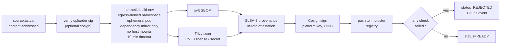

- Build pod in namespace `builds/` with NetworkPolicy denying all egress except an in-cluster Cargo / Go module / pip mirror.
- Mirror is read-only and pre-populated; new dependencies require a separate request process.
- Build pod has its own seccomp profile (looser than runtime — needs `mount` for `tmpfs`).
- Build outputs to `emptyDir`; runner copies binary to MinIO via unix-socket-only sidecar.
- 10 min wall-clock timeout, 4 GB memory cap. Fork bombs in `build.rs` die.
- Final image is **distroless** — no shell, no package manager, no `curl`, no `nc`.
- Image cosign-signed with the platform key (Sigstore Fulcio + Rekor).
- **SLSA-3 provenance** stored as `in-toto` attestation alongside image; admission-webhook verifies it.

### 4.4 Supply chain — platform components (T4 wall)

| Image source | Signing key | Verification |
|---|---|---|
| Submissions | `platform-submission-signer` (Sigstore Fulcio, ephemeral) | Admission-webhook on pod create |
| Platform components (operator, gateway, etc.) | `platform-component-signer` (long-lived, sealed-secret) | OPA Gatekeeper + ImagePolicyWebhook |
| Base images (distroless, alpine) | upstream Sigstore | Trivy asserts upstream signature |

Cosign verification policy (Gatekeeper Rego):

```rego
package ironbook.imagepolicy

violation[{"msg": msg}] {
  input.review.kind.kind == "Pod"
  container := input.review.object.spec.containers[_]
  not has_cosign_sig(container.image)
  msg := sprintf("image %v missing cosign signature", [container.image])
}

violation[{"msg": msg}] {
  input.review.kind.kind == "Pod"
  container := input.review.object.spec.containers[_]
  not contains(container.image, "@sha256:")
  msg := sprintf("image %v must be pinned by digest, not tag", [container.image])
}
```

### 4.5 Secrets management

| Class | Storage | Distribution | Rotation |
|---|---|---|---|
| Per-run mTLS certs | cert-manager → k8s Secret | Projected volume | Per-run (ephemeral) |
| Long-lived service mTLS | cert-manager → k8s Secret | Projected volume | 24 h, automatic |
| Cluster CA root | Sealed Secret in git | k8s Secret in `cert-manager` ns | Annual (manual) |
| Postgres / Redpanda / ClickHouse passwords | Sealed Secret in git | Projected volume | On compromise |
| Cloudflare token | Sealed Secret in git | Cloudflare-tunnel daemon | On compromise |
| Cosign signing key | Sealed Secret, decrypted on signer pod boot | In-memory only | Per release |
| User JWT secret | Sealed Secret | submission-api / leaderboard-api | Hourly (signed JWTs ≤ 1 h) |

k3s started with `--secrets-encryption` (AES-CBC at rest in etcd). Sealed-secrets-controller decrypts at apply time. **No secret is ever in a container ENV var** — all projected as files in tmpfs volumes.

### 4.6 IAM / RBAC

ServiceAccount-per-service, RBAC scoped narrowly.

```yaml
apiVersion: rbac.authorization.k8s.io/v1
kind: ClusterRole
metadata: { name: benchmark-operator }
rules:
  - apiGroups: ["ironbook.io"]
    resources: ["submissions","scenarios","benchmarkruns","botswarms",
                "submissions/status","benchmarkruns/status"]
    verbs: ["get","list","watch","create","update","patch","delete"]
  - apiGroups: [""]
    resources: ["pods","services","secrets","configmaps","events"]
    verbs: ["get","list","watch","create","update","patch","delete"]
  - apiGroups: ["cert-manager.io"]
    resources: ["certificates"]
    verbs: ["create","get","list","watch","delete"]
  # NOTE: no "*" verb, no cluster-admin, no node access, no exec
```

`exec` and `port-forward` into submission pods are denied for everyone, including the operator:

```yaml
apiVersion: admissionregistration.k8s.io/v1
kind: ValidatingWebhookConfiguration
metadata: { name: deny-exec-into-submissions }
webhooks:
  - name: deny-exec.ironbook.io
    rules:
      - operations: ["CONNECT"]
        apiGroups: [""]
        apiVersions: ["v1"]
        resources: ["pods/exec","pods/attach","pods/portforward"]
    namespaceSelector:
      matchLabels: { ironbook.io/sandbox: "true" }
    failurePolicy: Fail
```

A live demo of `kubectl exec submission-xxx -- sh` returning `Forbidden` is itself credible evidence.

### 4.7 Anti-cheat

A submission can lose by being slow. It cannot win by being clever in the wrong way.

| Cheat | Defence |
|---|---|
| Lying about own clock to fake low latency | Latency measured at the gateway, not the submission. Submission's `clock_gettime` is irrelevant to scoring. |
| Looking up `/proc` to detect "I'm in replay" | gVisor's user-space `/proc` leaks nothing about wall clock or PIDs of bot pods. AppArmor denies `/proc/sys/**`. |
| Recognising specific bots and gaming them | Identity stripped at gateway: `bot_id` removed, replaced by per-run opaque `session_token = sha256(bot_id ‖ run_secret)`. |
| Self-trade detection cheats | Oracle is ground truth; if submission's fills disagree with oracle's fills for the same input, it loses correctness regardless of clever reasoning. |
| Scenario detection | Scenario is replayed bit-identically across submissions. Strategy switching is fine — same input, evaluated equally. Cleverness rewarded, not penalised. |
| CPU mining or stealing background work | cgroup CPU pin to 2 cores; eBPF observer counts `sched_switch` events. Background work shows as elevated syscall count for no order traffic. |
| Resource hogging | cgroup memory.max + pids.max are hard limits. OOM kill = `BenchmarkRun → ABORTED`. |
| Replay-mode detection | No observable difference: same wire format, same opaque tokens, same `(platform_seq, platform_ts)` cadence. |

eBPF anti-cheat signal:

```rust
// crates/ebpf-observer/src/syscalls.bpf.rs (simplified)
SEC("tracepoint/syscalls/sys_enter")
fn on_sys_enter(ctx: SyscallEnterCtx) -> u32 {
    let cgrp_id = bpf_get_current_cgroup_id();
    if !is_submission_cgroup(cgrp_id) { return 0; }
    syscall_counter.increment(cgrp_id, ctx.syscall_nr, 1);
    0
}
```

The anti-cheat scorer flags runs where `syscall_count / order_count > 5x normal`, `clock_gettime fraction > 30%`, or long quiet periods followed by bursts. Flagged runs are re-run automatically; persistent flags drop the submission's Glicko rating.

### 4.8 Audit logging

Compliance-grade audit, stored two places:

```mermaid
flowchart LR
    api[kube-apiserver] -->|audit policy| audit_file[/var/log/audit.log]
    audit_file --> fluent[fluent-bit]
    fluent --> ch[(ClickHouse audit_events)]
    fluent --> mn[(MinIO archival<br/>signed daily snapshot)]
    ch --> graf[Grafana audit dashboard]
    submit[submission-api,<br/>operator,<br/>scoring-engine] -->|OTel span events| otel[OTel Collector]
    otel --> ch
```

kube-apiserver audit policy:

```yaml
apiVersion: audit.k8s.io/v1
kind: Policy
omitStages: ["RequestReceived"]
rules:
  - level: RequestResponse
    resources:
      - group: "ironbook.io"   # all our CRDs at full fidelity
  - level: Metadata
    resources:
      - group: ""
        resources: ["secrets","configmaps","pods/exec","pods/portforward"]
  - level: Metadata
```

App-level audit events (every mutating action) carry `actor`, `action`, `target`, `before`, `after`, `correlation_id`. Stored in ClickHouse `audit_events` (no TTL). Daily archival to MinIO: previous day's audit rows exported as Parquet, zstd-compressed, Cosign-signed, content-addressed. Tampering with one row invalidates the daily signature.

### 4.9 Out of scope (deliberately)

- **Hardware Security Modules (HSM).** Out of budget; sealed-secrets is honest at hackathon scale.
- **Public Sigstore Rekor transparency log.** We use Sigstore tooling with a private CA. Public Rekor documented as future work.
- **Trivy in adversarial-fuzzing mode.** CVE scanning only; per-submission fuzzing is unbounded compute.
- **CIS Benchmark.** Adopted relevant controls; full benchmark is future work.
- **Web Application Firewall beyond Caddy basics.** Single dashboard with JWT auth — rate-limit + body-size cap is sufficient.

---

## 5. Correctness & Replay Engine — APPROVED

The single biggest moat in the project. A parallel reference oracle, live stream-join divergence detection, content-addressed Parquet replay logs, and a CI gate that proves the pipeline is deterministic.

### 5.1 Formal correctness invariants

| # | Property | Statement | Detector |
|---|---|---|---|
| **C1** | Price-time priority | For any fill at price P from side `Bid`, no resting `Ask` at price ≤ P with earlier `platform_seq` was unfilled before it. (Symmetric for sells.) | Stream-join: oracle authoritative; submission disagreement = violation |
| **C2** | Fill conservation | For every accepted order, `Σ filled_qty ≤ original_qty`. For every fill, both referenced orders existed and had ≥ `qty` remaining at the time. | Per-order qty accounting in oracle |
| **C3** | No phantom fills | Every fill must reference orders the platform sent. | Oracle's input set is the universe |
| **C4** | Atomicity per order | An order ends in exactly one of: fully filled, partially filled + resting, fully resting, fully cancelled, rejected. | Lifecycle state machine asserted on every event |
| **C5** | Determinism | Same `(scenario_hash, oracle_image_sha256)` → same output stream. | Self-replay byte-equality CI gate (§5.6) |
| **C6** | Idempotency | Re-applying the same `(platform_seq, order)` produces identical state. | Property test in `crates/matching-engine` |

We require the *oracle* to be deterministic, not the submission. A submission can use random tie-breaking, parallel matching, anything — but it is scored on input replayed bit-identically against the oracle's deterministic decisions.

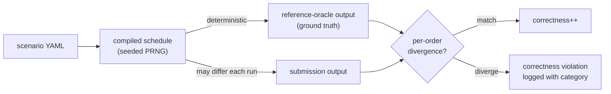

### 5.2 The reference oracle

A Rust matching engine in `crates/matching-engine`, wrapped at the wire by the `reference-oracle` service.

#### 5.2.1 Internal data model

```rust
// crates/matching-engine/src/types.rs (sketch)
#[derive(Clone, Copy, Debug, PartialEq, Eq, Hash)]
pub struct Price(pub i64);   // ticks; integer math, never floats

#[derive(Clone, Copy, Debug, PartialEq, Eq, Hash)]
pub struct Qty(pub u64);     // unsigned; subtraction is checked

#[derive(Clone, Copy, Debug, PartialEq, Eq)]
pub enum Side { Bid, Ask }

#[derive(Clone, Copy, Debug, PartialEq, Eq)]
pub enum OrderType { Limit { price: Price, tif: TimeInForce }, Market }

#[derive(Clone, Copy, Debug, PartialEq, Eq)]
pub enum TimeInForce { GTC, IOC, FOK }

#[derive(Clone, Debug)]
pub struct Order {
    pub platform_seq: u64,
    pub platform_ts: u64,
    pub client_order_id: u128,    // (bot_id, local_seq) packed
    pub session_token: SessionToken,
    pub side: Side,
    pub qty: Qty,
    pub kind: OrderType,
}

#[derive(Clone, Debug, PartialEq, Eq)]
pub struct Fill {
    pub trade_id: u64,
    pub platform_seq_taker: u64,
    pub platform_seq_maker: u64,
    pub price: Price,
    pub qty: Qty,
    pub ts: u64,
}
```

Integer-only prices and quantities — no floats, ever. `u128 client_order_id` packs `(bot_id, local_seq)` so independent bot sequences never collide. `platform_seq` is the global ordering; `platform_ts` is informational.

#### 5.2.2 Order book

```rust
pub struct OrderBook {
    bids: BTreeMap<Price, VecDeque<Resting>>,  // descending iteration (best bid)
    asks: BTreeMap<Price, VecDeque<Resting>>,  // ascending  iteration (best ask)
    by_id: HashMap<u128, OrderRef>,
    next_trade_id: u64,
}
```

`BTreeMap` gives O(log N) best-price + ordered iteration — exactly the matching loop's access pattern. Per-level `VecDeque` is the price-time priority queue (push back, pop front, both O(1), contiguous in cache). Same shape as Nasdaq ITCH order books.

#### 5.2.3 Match algorithm (limit order, simplified)

```rust
pub fn match_limit(&mut self, taker: Order) -> Vec<Fill> {
    let mut fills = Vec::new();
    let mut remaining = taker.qty;
    let opposite = match taker.side { Side::Bid => &mut self.asks, Side::Ask => &mut self.bids };
    while let Some((&best_price, queue)) = next_best(opposite, taker.side) {
        if !crosses(taker.kind, taker.side, best_price) { break; }
        while let Some(resting) = queue.front_mut() {
            if remaining.0 == 0 { break; }
            let traded = remaining.min(resting.qty_remaining);
            fills.push(Fill { trade_id: self.next_trade_id, platform_seq_taker: taker.platform_seq,
                              platform_seq_maker: resting.platform_seq, price: best_price,
                              qty: traded, ts: taker.platform_ts });
            self.next_trade_id += 1;
            remaining = remaining.checked_sub(traded).unwrap();
            resting.qty_remaining = resting.qty_remaining.checked_sub(traded).unwrap();
            if resting.qty_remaining.0 == 0 { queue.pop_front(); }
        }
        if queue.is_empty() { opposite.remove(&best_price); }
        if remaining.0 == 0 { break; }
    }
    if remaining.0 > 0 {
        match taker.kind {
            OrderType::Limit { tif: TimeInForce::IOC, .. } => { /* discard */ }
            OrderType::Limit { tif: TimeInForce::FOK, .. } if !fills.is_empty() => {
                self.rollback(&fills); fills.clear();
            }
            OrderType::Limit { price, tif: TimeInForce::GTC } => self.rest(taker.with_qty(remaining), price),
            OrderType::Market => { /* discard remaining */ }
            _ => {}
        }
    }
    fills
}
```

#### 5.2.4 Property tests

`tests/proptest.rs` generates random sequences and asserts C1–C6:

```rust
proptest! {
    #[test]
    fn fill_conservation(orders in arb_order_sequence(1..1000)) {
        let mut book = OrderBook::new();
        let (mut buy_filled, mut sell_filled) = (0u64, 0u64);
        for o in &orders {
            for f in book.apply(o.clone()) {
                match o.side { Side::Bid => buy_filled += f.qty.0, Side::Ask => sell_filled += f.qty.0 }
                prop_assert!(f.qty.0 > 0); prop_assert!(f.price.0 > 0);
            }
        }
        prop_assert_eq!(buy_filled, sell_filled);
    }

    #[test]
    fn price_time_priority(orders in arb_order_sequence(1..500)) {
        let mut book = OrderBook::new();
        for o in &orders {
            for f in &book.apply(o.clone()) {
                prop_assert!(book.has_no_better_unfilled(f));
            }
        }
    }

    #[test]
    fn idempotent_reapply(orders in arb_order_sequence(1..200)) {
        let (mut a, mut b) = (OrderBook::new(), OrderBook::new());
        for o in &orders { a.apply(o.clone()); b.apply(o.clone()); b.apply(o.clone()); }
        prop_assert_eq!(a.snapshot(), b.snapshot());
    }
}
```

#### 5.2.5 Snapshot + recovery

The oracle pod can crash mid-run. On restart it reads the most recent snapshot from `/tmp/oracle-snap.zst` (taken every 100k events) and replays the Parquet input log from that point. Snapshots are deterministic — post-recovery output is byte-identical to the no-crash output. Asserted in chaos tests.

### 5.3 Live divergence detection

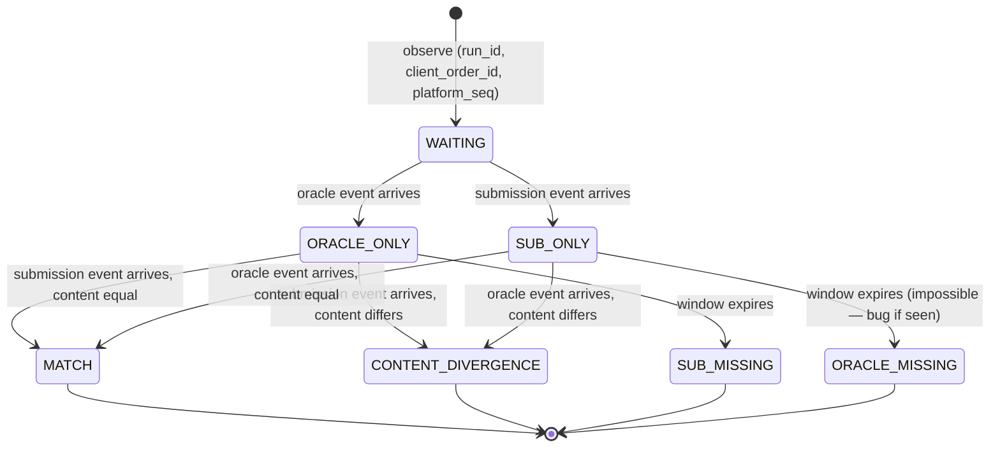

```rust
struct State {
    pending: LruCache<Key, Pending>,
    metrics: Counters,
}
enum Pending { OracleOnly(OracleEvent, Instant), SubOnly(SubEvent, Instant) }
type Key = (RunId, OrderId, PlatformSeq);

fn on_oracle(state: &mut State, ev: OracleEvent) {
    let key = ev.key();
    match state.pending.pop(&key) {
        Some(Pending::SubOnly(sub, _)) => emit_compare(state, ev, sub),
        Some(Pending::OracleOnly(_, _)) => unreachable!("oracle dup"),
        None => state.pending.put(key, Pending::OracleOnly(ev, Instant::now())),
    }
    state.gc_expired();
}
```

**Sizing**: window = 10 s of throughput; LRU capacity = `peak_orders_per_sec × 10 × 1.5` (50% headroom). At 50k orders/s sustained, ~750k entries × 256 B = ~192 MB resident.

**Divergence categories and score impact:**

| Category | Meaning | Score impact |
|---|---|---|
| `MATCH` | Submission and oracle agreed | +1 to correctness count |
| `CONTENT_DIVERGENCE` | Different fills (count, price, qty, counterparty) | -1, weighted heavily; correctness gate |
| `SUB_MISSING` | Submission did not produce an event for an order the gateway sent | -1, availability fail |
| `ORACLE_MISSING` | Oracle did not produce an event but submission did | Platform bug, not submission; run flagged invalid |

The composite scoring formula in §6 uses `(matches / total)` as `correctness ∈ [0, 1]` as a **gate**: any submission below 0.999 correctness is ineligible to win regardless of latency.

Watermarking: Redpanda partitions for `submission_out` and `oracle_out` keyed by `run_id`. Within a single `(run_id, partition)`, ordering is preserved. Detector advances a watermark per partition based on the slowest of the two streams; "missing" events are emitted only past the watermark.

### 5.4 Deterministic replay format

#### 5.4.1 Parquet schema

| Column | Type | Notes |
|---|---|---|
| `platform_seq` | INT64 | Primary ordering |
| `platform_ts` | INT64 | Monotonic ns |
| `run_id` | BINARY (FIXED, 16) | UUID v7 |
| `client_order_id` | BINARY (FIXED, 16) | u128 packed |
| `session_token` | BINARY (FIXED, 32) | Identity-stripped opaque |
| `op` | INT32 | 0=NEW, 1=CANCEL, 2=AMEND |
| `side` | INT32 | 0=Bid, 1=Ask |
| `qty` | INT64 | Unsigned semantics |
| `price` | INT64 | Tick count |
| `order_type` | INT32 | 0=Limit, 1=Market |
| `tif` | INT32 | 0=GTC, 1=IOC, 2=FOK |
| `wire_format` | INT32 | 0=REST, 1=WS, 2=FIX |
| `oracle_fills` | LIST<STRUCT> | For fast offline divergence comparison |
| `oracle_acks` | LIST<STRUCT> | Status, code, message |

Row groups 100k rows; zstd level 6; statistics enabled on `platform_seq`, `run_id`, `op` for partition pruning.

#### 5.4.2 Content addressing

```
file_id = sha256( schema_version_bytes ‖ canonical_record_serialization )
```

File path: `s3://ironbook-replay/<run_id>/<file_id>.parquet`. Manifest: `(run_id, scenario_hash, submission_sha256, oracle_image_sha256, file_id, started_at, duration, total_events)`.

#### 5.4.3 Sealing

Replay log is append-only during run, sealed at COMPLETE. Sealing: write final Parquet footer, compute `file_id`, write `manifest.json`, set MinIO `Object-Lock` retention to "compliance mode" 7 days. Tampering is auditable.

### 5.5 Replay-driven A/B comparison and tournaments

#### 5.5.1 Single A/B replay

```mermaid
sequenceDiagram
    actor Judge
    participant Op as benchmark-operator
    participant Rep as replay-engine
    participant MN as MinIO
    participant GW as fairness-gateway
    participant SubA as submission-A pod
    participant SubB as submission-B pod
    participant Or as reference-oracle

    Judge->>Op: replay run R against {A, B}
    Op->>Rep: prepare two BenchmarkRuns sharing replay_source = R.file_id
    par run A
        Rep->>MN: GET R.parquet
        Rep->>GW: re-emit (preserve platform_seq, ts)
        GW->>SubA: stamped order
        GW->>Or: stamped order
        SubA-->>GW: ack + fills
        Or-->>GW: ack + fills
    and run B
        Rep->>MN: GET R.parquet
        Rep->>GW: re-emit (preserve platform_seq, ts)
        GW->>SubB: stamped order
        GW->>Or: stamped order
        SubB-->>GW: ack + fills
        Or-->>GW: ack + fills
    end
    Note over Rep: A and B faced byte-identical input;<br/>scoring is directly comparable
```

#### 5.5.2 Tournament mode (Glicko-2)

Submissions get a **rating with uncertainty**, updated after every scenario:
- `μ` (rating, ELO-equivalent)
- `φ` (rating deviation, shrinks with more matches)
- `σ` (volatility, grows when results are inconsistent)

Leaderboard sorts by `μ - 2φ` (conservative lower bound) — submissions with too few runs sort low until they prove themselves.

#### 5.5.3 Statistical significance

Three replay runs per (submission, scenario) cell; report median and IQR. For "is A faster than B at p99 on scenario S?" — Mann-Whitney U test, α = 0.05. Non-significant → leaderboard shows tied.

### 5.6 Self-replay byte-equality CI gate

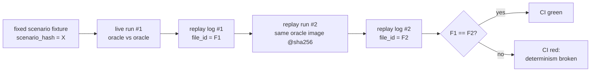

CI step `make ci-self-replay` runs scenario X twice (live then replay), captures both logs, asserts `F1 == F2`. If unequal, something between time-service, gateway, and oracle introduced non-determinism. CI red, ship blocked.

### 5.7 Edge cases and known limits

| Op | Behaviour | Divergence semantics |
|---|---|---|
| `NEW` | Match against book or rest | Compare fills + ack |
| `CANCEL` | Remove resting order | Compare ack and any pending fills against cancel-race |
| `AMEND` | Modelled as `CANCEL + NEW` | Compare both legs |
| `IOC` | Match what's available, discard remainder | Compare fills only |
| `FOK` | All-or-nothing | If fills ≠ qty → reject + cancel ack; compare ack |

**Cancel-race**: bot sends `NEW(qty=10)` then `CANCEL`. Two valid outcomes (zero fills or partial); oracle's deterministic ordering picks one and submission must agree.

**Identical timestamps**: two orders with the same `platform_ts` are still totally ordered by `platform_seq`.

**Float drift in scoring**: Glicko-2 uses `f64`; x86 vs ARM math drifts in 14th decimal. Round to 6 decimals before comparison; store exact `(μ, φ, σ)` alongside displayed integer rating.

**Oracle bugs**: property tests + hand-written fixtures from real exchanges. Future work: consensus oracle (two implementations, require agreement).

**Replay across submission versions**: replay run R against `submission Y'` (different version). Same input, new score. Canonical use case for grading.

### 5.8 Out of scope

- Cross-symbol matching. Single-symbol books only; multi-symbol = future work.
- Auction sessions (NYSE-style opening / closing). Future work.
- Pro-rata or size-priority matching. Pure price-time only.
- Self-trade prevention. Optional; off by default.
- Hidden / iceberg orders. Not modelled.
- Market data dissemination protocol. Submissions get fills/acks back, not L2/L3 feed. Future work.

---

## 6. Observability & Scoring — APPROVED

The platform is transparent — every order has a distributed trace; every CPU cycle is profiled; every score decomposes into auditable components. Five clicks from "the number on the leaderboard" to "the order that produced it."

### 6.1 OpenTelemetry pipeline

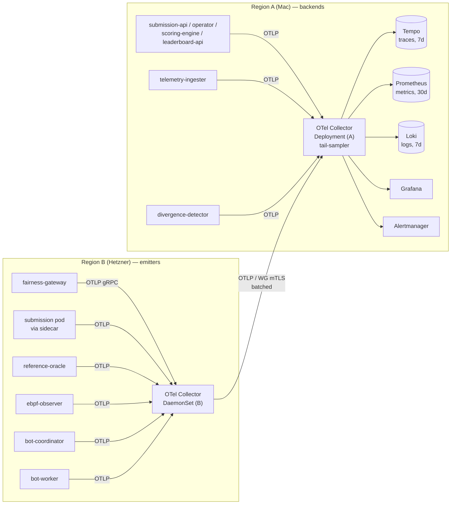

**Two-tier collector design**: Region B is a low-overhead DaemonSet that batches; Region A applies tail-sampling. Any trace with a divergence event, an error, or a > 5 ms span is retained at 100%; everything else samples at 1%.

```yaml
processors:
  tail_sampling:
    decision_wait: 10s
    num_traces: 100000
    expected_new_traces_per_sec: 50000
    policies:
      - { name: errors_always,      type: status_code,        status_code: { status_codes: [ERROR] } }
      - { name: divergences_always, type: string_attribute,   string_attribute: { key: ironbook.divergence, values: ["true"] } }
      - { name: latency_outliers,   type: latency,            latency: { threshold_ms: 5 } }
      - { name: random_sample,      type: probabilistic,      probabilistic: { sampling_percentage: 1 } }
```

### 6.2 Per-order distributed tracing

Span tree per order:

```
trace: order-{client_order_id}-{platform_seq}
└── bot.send                                      (bot-worker)
    └── gateway.receive                            (fairness-gateway)
        └── gateway.stamp
        └── gateway.fork
            ├── submission.handle                  (submission via sidecar)
            │   ├── submission.match
            │   └── submission.ack
            └── oracle.handle                      (reference-oracle)
                ├── oracle.match
                └── oracle.ack
        └── divergence.compare                     (async)
```

W3C Trace Context propagation. Custom span attributes: `ironbook.run_id`, `ironbook.platform_seq`, `ironbook.scenario_hash`, `ironbook.symbol`, `ironbook.side`, `ironbook.order_type`. Forbidden as metric labels (allowed on traces): `client_order_id`, `bot_id` (high cardinality).

Overhead: ~200 B per order at 1% sampling = ~2 KB/s at 10k orders/s.

Demo gold: a judge clicks any leaderboard row → Grafana Tempo → full span tree of one order with submission and oracle paths visible side-by-side.

### 6.3 Metrics — histograms and labels

Latency histograms:

```
ironbook_order_latency_us_bucket{
  run_id, scenario_hash, symbol, side, order_type,
  measurement_point  # "gateway_in_to_ack" | "submission_engine" | "oracle_engine"
}
```

Buckets (µs, exponential): `10, 25, 50, 100, 250, 500, 1k, 2.5k, 5k, 10k, 25k, 50k, 100k, +Inf`.

For score-of-record, ClickHouse `quantileTDigestState` is the source. Prometheus histograms power Grafana but don't drive scoring.

Allowed dimensions (cardinality bounded): `run_id` (10² active, 10⁴ historical w/ 30 d TTL), `scenario_hash` (~10²), `symbol` (~10), `side` (2), `order_type` (2), `measurement_point` (3), `submission_sha256` (~10²). Total ~24 M combinations — Prometheus is comfortable.

Other metric families:

```
ironbook_orders_total{run_id, op}
ironbook_correctness_violations_total{run_id, kind}
ironbook_throughput_ops_per_sec{run_id}
ironbook_gvisor_syscall_total{run_id, syscall}
ironbook_anti_cheat_score{run_id}
ironbook_redpanda_consumer_lag{topic, partition, group}
ironbook_clickhouse_insert_rows_per_sec{table}
```

### 6.4 Continuous profiling (Parca)

Parca DaemonSet, eBPF-based CPU profiles at 19 Hz. No instrumentation. Per-pod flame graphs, live; diff view across regimes.

Storage budget: 19 Hz × 10 active pods × 7 d × 200 B/sample = ~115 MB.

Profile labels: `parca_pprof{pod, container, run_id, submission_sha256, scenario_hash}`. Frontend embeds Parca iframe per `BenchmarkRun` row.

### 6.5 ClickHouse schema

#### 6.5.1 `runs_raw` — every event

```sql
CREATE TABLE runs_raw
(
    run_id           UUID,
    platform_seq     UInt64,
    platform_ts      UInt64,
    event_kind       Enum8('order'=1,'ack'=2,'fill'=3,'cancel'=4,'divergence'=5),
    client_order_id  UInt128,
    session_token    FixedString(32),
    side             Enum8('bid'=1,'ask'=2),
    qty              UInt64,
    price            Int64,
    order_type       Enum8('limit'=1,'market'=2),
    tif              Enum8('gtc'=1,'ioc'=2,'fok'=3),
    in_ts_ns         UInt64,
    ack_ts_ns        UInt64,
    fills            Array(Tuple(trade_id UInt64, maker_seq UInt64, price Int64, qty UInt64)),
    divergence_kind  Enum8('match'=1,'content'=2,'sub_missing'=3,'oracle_missing'=4) DEFAULT 'match',
    submission_sha256 FixedString(64),
    scenario_hash    FixedString(64),
    inserted_at      DateTime64(9) DEFAULT now64()
)
ENGINE = MergeTree
PARTITION BY toYYYYMMDD(inserted_at)
ORDER BY (run_id, platform_seq)
SETTINGS index_granularity = 8192,
         storage_policy = 'tiered_zstd',
         ttl = 'inserted_at + INTERVAL 7 DAY DELETE'
;
```

`ORDER BY (run_id, platform_seq)` matches every score query's access pattern. `tiered_zstd` storage policy: hot tier on local SSD, cold tier on MinIO via S3 disk after 24 h.

#### 6.5.2 `runs_per_sec` — 1-second rollups

```sql
CREATE MATERIALIZED VIEW runs_per_sec
ENGINE = AggregatingMergeTree
PARTITION BY toYYYYMMDD(ts_sec)
ORDER BY (run_id, ts_sec)
AS SELECT
    run_id,
    toStartOfInterval(fromUnixTimestamp64Nano(ack_ts_ns), INTERVAL 1 SECOND) AS ts_sec,
    count()                                                  AS orders,
    countIf(event_kind = 'fill')                             AS fills,
    countIf(divergence_kind != 'match')                      AS divergences,
    quantileTDigestState(0.5)(ack_ts_ns - in_ts_ns)          AS p50_state,
    quantileTDigestState(0.99)(ack_ts_ns - in_ts_ns)         AS p99_state,
    sumState(toUInt64(qty))                                  AS qty_state
FROM runs_raw
WHERE event_kind = 'ack'
GROUP BY run_id, ts_sec
;
```

`quantileTDigestState` is mergeable — final p50/p99 over any window comes from merging per-second states, not re-scanning raw events.

#### 6.5.3 `runs_summary` — final per-run

```sql
CREATE MATERIALIZED VIEW runs_summary
ENGINE = AggregatingMergeTree
ORDER BY run_id
AS SELECT
    run_id,
    minState(in_ts_ns)                                       AS started_at_state,
    maxState(ack_ts_ns)                                      AS ended_at_state,
    countState()                                             AS total_orders_state,
    quantileTDigestState(0.5)(ack_ts_ns - in_ts_ns)          AS p50_state,
    quantileTDigestState(0.9)(ack_ts_ns - in_ts_ns)          AS p90_state,
    quantileTDigestState(0.99)(ack_ts_ns - in_ts_ns)         AS p99_state,
    quantileTDigestState(0.999)(ack_ts_ns - in_ts_ns)        AS p999_state,
    countIfState(divergence_kind = 'content')                AS content_div_state,
    countIfState(divergence_kind = 'sub_missing')            AS sub_miss_state,
    countIfState(divergence_kind = 'match')                  AS match_state
FROM runs_raw
GROUP BY run_id
;
```

Scoring engine queries this view exclusively.

### 6.6 Composite scoring formula

```
score = correctness_gate × (1 - anti_cheat_penalty) ×
        ( 0.40 × latency_score
        + 0.20 × throughput_score
        + 0.20 × tail_score
        + 0.20 × stability_score )
        × 1000
```

| Term | Formula | Range | Notes |
|---|---|---|---|
| `correctness_gate` | `1 if (matches/total) ≥ 0.999 else 0` | {0, 1} | Hard gate |
| `anti_cheat_penalty` | sum of weighted flags from §6.8 | [0, 1] | 0.1 per flag, capped 1.0 |
| `latency_score` | `clamp(1 - log10(p50_us / p50_target_us), 0, 1)` | [0, 1] | Targets per scenario |
| `throughput_score` | `clamp(sustained_tps / tps_target, 0, 1)` | [0, 1] | Sustained for ≥ 60% of run |
| `tail_score` | `clamp(1 - log10(p99_us / p99_target_us), 0, 1)` | [0, 1] | Penalises p99 outliers |
| `stability_score` | `1 - (p99 - p50) / (p99 + p50)` | [0, 1] | CV-style |

**Worked example.** p50 = 90 µs, p99 = 250 µs, sustained TPS = 45k, correctness = 100%, no flags, scenario targets `p50=50, p99=200, tps=50000`:

```
latency_score    = clamp(1 - log10(90/50),   0, 1) = 0.745
throughput_score = clamp(45000/50000,        0, 1) = 0.900
tail_score       = clamp(1 - log10(250/200), 0, 1) = 0.903
stability_score  = 1 - (250-90)/(250+90)            = 0.530

score = 1 × 1 × (0.40×0.745 + 0.20×0.900 + 0.20×0.903 + 0.20×0.530) × 1000 = 765
```

Log scale on latency: meaningful gap at 50 vs 100 µs; smaller gap at 5 vs 10 ms.

Correctness as a *gate*, not a *weight*: a 50-µs engine that gets fills wrong is worse than useless.

Targets in `scenario.yaml`:

```yaml
targets:
  p50_us: 50
  p99_us: 200
  tps:    50000
  duration_min_seconds: 300
```

Targets are not secret. Reproducible per-scenario scale.

Every term in the score is derivable from `runs_summary`. A judge can click `score` → breakdown → `latency_score` underlying state → raw distribution → an outlier bucket → traces in Tempo. Five clicks from "the number" to "the order that produced it."

### 6.7 Glicko-2 rating across scenarios

Each submission has `(μ, φ, σ)`:
- `μ` rating, displayed as `1500 + (μ × 173.7178)` (ELO-equivalent).
- `φ` rating deviation, shrinks with more matches.
- `σ` volatility, grows when results are inconsistent.

After every `BenchmarkRun.COMPLETE`:

```
expected_outcome = sigmoid((submission_score - scenario_baseline) / 100)
actual_outcome   = submission_score / 1000   # in [0, 1]
```

Update batched every 15 min (rating period).

Leaderboard sort: `μ - 2φ` (conservative lower bound). Submissions with too few runs sort low until they prove themselves.

Display:

```
rank │ submission       │ rating         │ runs │ last_seen
─────┼──────────────────┼────────────────┼──────┼──────────
  1  │ rust-engine-v3   │ 1842 ± 32     │  47  │ 2 min ago
  2  │ go-matcher-pro   │ 1791 ± 28     │  52  │ 5 min ago
  3  │ cpp-hft-attempt  │ 1755 ± 88     │   9  │ 12 min ago    ← high uncertainty
```

`±` is `1.96 × φ_display` (95% CI).

### 6.8 Anti-cheat scoring signals

| Signal | Source | Weight | Trigger |
|---|---|---|---|
| Excessive `clock_gettime` | eBPF | 0.1 | > 30% of total syscalls |
| Background syscalls | eBPF | 0.2 | `syscall_count / order_count > 5×` rolling baseline |
| Quiet-then-burst | eBPF | 0.1 | gaps > 1 s, then > 100 ops in 10 ms |
| CPU on idle pod | cgroup | 0.2 | CPU accumulated when no orders pending in last 10 s |
| Network egress attempt | iptables counter | 0.5 | non-zero blocked packets |
| Memory growth past steady-state | cgroup | 0.1 | RSS > 90% limit for > 60 s after warmup |
| Repeated divergence | divergence-detector | 0.3 | same `client_order_id` diverges in 3+ replays |
| Determinism breach | replay engine | 0.5 | output differs across two byte-identical replays |

`anti_cheat_penalty = min(1.0, Σ weights)`. Auto-rerun on a single flag; persistent flags drop the rating; transient flags don't.

### 6.9 Grafana dashboards

| Dashboard | For | Key panels |
|---|---|---|
| Live Leaderboard | Judges (default) | rank table, top-3 latency CDFs, correctness gauge, regime indicator |
| Run Inspector | Judges (drilldown) | trace tree (Tempo embed), latency histogram, divergence list, syscall heatmap, Parca flame graph |
| Submission History | Judges (per-submission) | rating sparkline, scenarios played, p99 over time, anti-cheat history |
| Platform Health | Operator | Redpanda lag, CH insert rate, gateway QPS, gVisor pod count, WG link RTT |
| Audit | Operator | mutating CR ops, exec attempts, signature verification events |

Dashboards committed as JSON under `deploy/grafana/dashboards/`, provisioned by Argo CD.

### 6.10 Alertmanager

| Alert | Trigger | Severity |
|---|---|---|
| `OracleDivergenceLag` | divergence detector lag > 30 s | critical |
| `RedpandaLag` | consumer lag > 10× p99 | warn |
| `ClickHouseInsertFailing` | insert error rate > 1% for 1 min | critical |
| `WireguardLinkDown` | WG handshake older than 60 s | critical |
| `ProvenanceVerifyFailed` | image without SLSA attestation | critical |
| `OracleMissingEvent` | any `oracle_missing` divergence | critical |
| `ChaosAgentTriggered` | chaos action initiated | info |
| `BenchmarkRunStuckPriming` | run in PRIMING > 30 s | warn |

Slack/Discord webhook (no team to page).

### 6.11 Out of scope

- Distributed tracing across the WG link at the order-flow level (order flow stays intra-cluster).
- Adaptive sampling (rule-based only).
- SLO error-budget burn-rate dashboards (future work).
- Cost tracking (Hetzner is flat €10/mo).

---

## 7. Testing Strategy — APPROVED

A platform that grades correctness must be correctness-tested. Strict pyramid plus property tests, chaos tests, and the self-replay byte-equality CI gate.

### 7.1 Test pyramid

```
           ┌─────────────────────────┐
           │     E2E (kind cluster)   │   ~12 tests, 8–15 min wall  ── 1×/PR + nightly
           ├─────────────────────────┤
           │   Chaos suite           │   ~8 scenarios, 20 min        ── nightly only
           ├───────────────────────────┤
           │  Integration            │   ~80 tests, ~3 min total     ── per-PR
           ├─────────────────────────────┤
           │      Property-based     │   ~12 properties × 1k cases   ── per-PR
           ├───────────────────────────────┤
           │        Unit             │   ~600 tests, ~30 s total     ── per-commit
           └─────────────────────────────────┘
```

PR budget: ≤ 5 min `git push` to green check. Slower → nightly.

Coverage targets (judged on what's tested, not enforced as a number):
- Matching engine: 100% line, 90% branch (property tests carry most weight).
- Operator reconcilers: ≥ 80% line.
- Gateway / sidecar / ingester / divergence-detector: ≥ 75%.
- Frontend: smoke E2E only.

### 7.2 Unit tests

#### Rust crates
Run via `cargo nextest run --workspace`. Conventions: every `pub fn` has a happy-path test; every `Result` has an error-path test. Naming by suffix: `test_*`, `prop_*`, `bench_*`.

#### Go packages
Run via `go test ./... -race -count=1 -timeout 60s`. `-race` is mandatory. Table-driven tests with `t.Run(...)` subtests.

#### Fakes vs mocks
Mocks lie about the system. Fakes implement it cheaply.
- Postgres / ClickHouse / Redpanda / Redis → real, in Testcontainers.
- K8s API → `controller-runtime/pkg/client/fake`.
- gRPC clients → `bufconn` in-memory transport.
- `pgxmock` only when the SQL is the unit under test.

### 7.3 Property-based tests

Twelve properties total (see §5.2.4):

| Component | Properties |
|---|---|
| Matching engine | C1 (PTP), C2 (fill conservation), C6 (idempotency) |
| Replay format | round-trip, content-address stability, schema-version compat |
| Time-service | monotonicity, batch alignment, recovery-monotonic |
| Scenario compiler | seed determinism, schedule monotonicity, serialization stability |

256 cases per CI invocation; 4096 in nightly via `PROPTEST_CASES=4096`.

### 7.4 Integration tests (Testcontainers)

```go
func TestSubmissionUpload_HappyPath(t *testing.T) {
    ctx := context.Background()
    pg := tcpg.MustRun(ctx, "postgres:16-alpine", ...);    defer pg.Terminate(ctx)
    minio := tcminio.MustRun(ctx, ...);                     defer minio.Terminate(ctx)
    rp := tcredpanda.MustRun(ctx, "redpandadata/redpanda:v24.1.1"); defer rp.Terminate(ctx)

    api := newAPIServer(t, pg, minio, rp); defer api.Close()
    sha, err := api.Upload(ctx, "fixtures/hello-world.tar.zst")
    require.NoError(t, err)
    require.Equal(t, "sha256:abc123...", sha)
    obj, _ := minio.GetObject(ctx, "submissions", sha)
    require.Equal(t, sha, obj.ETag)
    row := pg.QueryOne(t, "SELECT status FROM submissions WHERE sha256 = $1", sha)
    require.Equal(t, "PENDING", row.Status)
    events := rp.Consume(ctx, "submissions.uploaded", 1, 5*time.Second)
    require.Len(t, events, 1)
}
```

Conventions: one container per test class via `t.Cleanup`; tests parallelizable; fixtures content-addressed.

### 7.5 End-to-end tests (kind cluster)

```
tests/e2e/
  fixtures/
    submissions/
      correct-rust-engine/         # template impl that should always pass
      correct-go-engine/
      slow-engine/                 # adds 5ms sleep per order
      buggy-engine-wrong-fills/    # produces wrong fill prices
      buggy-engine-no-acks/        # never acks (sub_missing storm)
      malicious-egress/            # tries to dial out (must be blocked)
      malicious-fork-bomb/         # tries to fork (must be killed by pids.max)
      malicious-mem-bomb/          # mallocs 8 GB (must OOM-kill)
      cheat-clock-spoof/           # lies about its own clock
      cheat-replay-detector/       # tries to detect replay mode
  scenarios/{quiet-market,burst,crash-regime}.yaml
  cases/
    01_upload_to_ready.go
    02_correct_engine_scores.go
    03_slow_engine_loses_p99.go
    04_buggy_engine_fails_gate.go
    05_malicious_egress_blocked.go
    06_fork_bomb_killed.go
    07_mem_bomb_oom.go
    08_clock_spoof_no_effect.go
    09_replay_undetectable.go
    10_self_replay_byte_equal.go
    11_chaos_pod_kill_recovers.go
    12_two_region_telemetry.go
```

kind cluster created once per CI job; cases run sequentially. Fresh cluster only on cluster-bootstrap tests.

### 7.6 Chaos suite (nightly only, 20 min)

| Scenario | Action | Expected |
|---|---|---|
| `oracle-pod-kill-mid-run` | delete oracle pod at t=30s | restart from snapshot, score within 5% of baseline |
| `gateway-pod-kill-mid-run` | delete gateway pod | bot retries succeed; run completes |
| `network-loss-10pct` | tc netem 10% loss bots↔gateway | p99 spikes, correctness unaffected |
| `cpu-throttle-50pct` | cgroup CPU limit halved on submission | throughput drops, score drops, no crashes |
| `redpanda-broker-restart` | restart broker | telemetry catches up via consumer group |
| `clickhouse-down-30s` | stop CH for 30s | ingester drops with counter; CH catches up |
| `wg-link-flap` | WG down 5s | region B unhealthy; new runs paused; old continue |
| `clock-skew-50ms` | chronyc settime +50ms on Hetzner | time-service detects, fail-fast new orders |

Regressions are CI-blocking.

### 7.7 Performance regression suite

Targets enforced in CI:

| Bench | Target | Hard fail at |
|---|---|---|
| `match_limit_uncrossed` | ≥ 1.5M ops/s | < 1.0M |
| `match_limit_one_fill` | ≥ 800k ops/s | < 500k |
| `match_limit_walk_5_levels` | ≥ 200k ops/s | < 120k |
| `gateway.fork_p99` | ≤ 50 µs | > 100 µs |
| `telemetry-ingester.insert_batch` (1k rows) | ≥ 50k rows/s | < 20k |

`criterion` baseline diff against last green main; > 10% regression flags PR.

### 7.8 Fuzzing (cargo fuzz, nightly)

| Target | Why |
|---|---|
| `fuzz_target_match` | Random bytes → matching engine; panics, overflows, infinite loops |
| `fuzz_target_fix_parser` | Random FIX 4.4 → gateway parser |
| `fuzz_target_replay_parquet` | Random Parquet → replay-engine deserializer |

30 min each. Crashes committed as fixtures and added to unit suite.

### 7.9 Mutation testing

`cargo mutants` against `crates/matching-engine` only. Target ≥ 90% mutants caught. Not a CI gate; runs weekly + on demand.

### 7.10 Sample submissions as fixtures

The ten fixtures double as the public **contestant template library** under `templates/`. The E2E suite tests real submissions, not synthetic doubles.

### 7.11 CI pipeline DAG

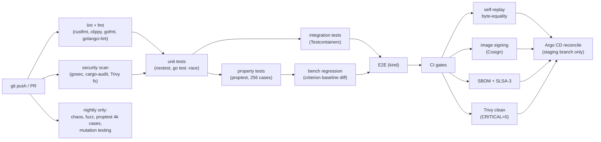

PR target: ≤ 12 min (parallelizable to ≤ 6 min). Nightly: ~90 min at 03:00 UTC.

### 7.12 CI gates (must pass to merge)

- Unit + integration tests green
- Property tests green
- `make ci-self-replay` (determinism intact)
- No criterion bench regressed > 10%
- All images Cosign-signed
- SLSA-3 attestations present
- Trivy: 0 CRITICAL CVEs in final images
- `gosec` and `cargo-audit` clean
- No new `unwrap()` / `expect()` in non-test Rust without `// SAFETY:` annotation
- Generated protobuf in sync (`make proto && git diff --exit-code`)

### 7.13 Local developer workflow

```
make dev                 # spin up minimal local stack: kind + PG + CH + Redpanda
make test-unit           # ~30 s
make test-prop           # ~1 min (matching-engine changes)
make test-integ          # ~3 min (PR prep)
make test-e2e            # ~15 min (rare)
make ci-local            # mirrors PR check, ~6 min
make bench               # ~3 min
make fuzz                # 30 s smoke; full nightly
make chaos local-1h      # one chaos scenario manually
```

### 7.14 Out of scope

- Visual regression testing of the dashboard.
- Synthetic load tests beyond bench suite (the bot fleet is the load test).
- Browser-based E2E beyond one `chromedp` smoke step.
- Cross-platform testing (Linux ARM64 + AMD64 only).
- CodeQL / commercial static analyzers.

---

## 8. Failure Modes & Error Handling — APPROVED

A platform that hides its failure modes is a platform that's lying. Six classes of failure, explicit RTO/RPO per data class, hard backpressure rules, manual runbooks.

### 8.1 Failure taxonomy

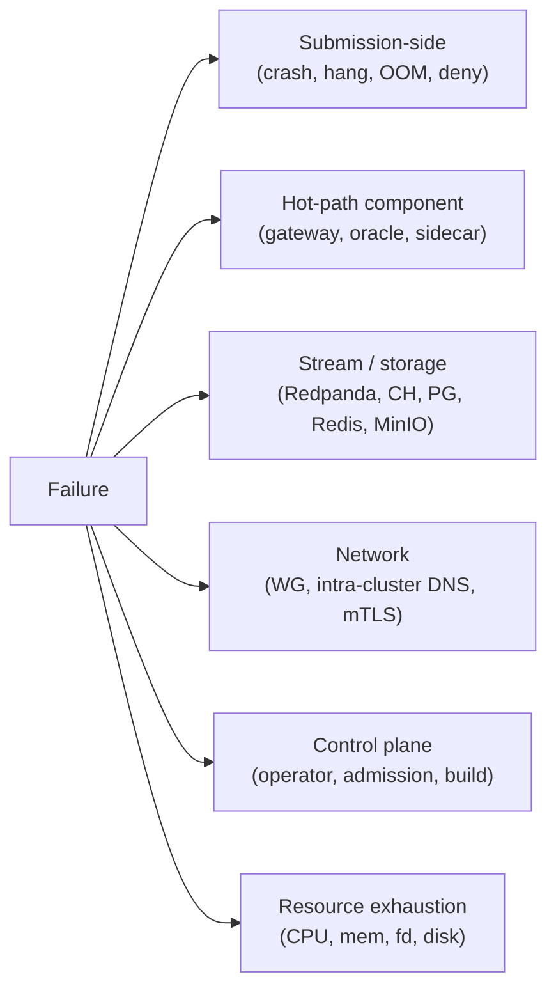

For each failure: **Detection** (signal that fires), **Blast radius** (what's affected), **Recovery** (automated path back), **Run impact** (in-flight `BenchmarkRun`s). The platform fails honestly — no silent recoveries that mask throughput; no auto-retry on submission-caused failures.

### 8.2 Submission-side failures

Submissions are untrusted; failures are *expected* and reported as data, not platform errors.

| Mode | Detection | Blast | Recovery | Run impact |
|---|---|---|---|---|
| Crash (SIGSEGV / SIGBUS) | k8s pod restart count, gateway connection reset, sidecar EOF | Single run | `ABORTED` with `reason: SubmissionCrash`. **Not auto-retried.** | Run terminates; partial telemetry preserved |
| Hang (no ack within 10 s) | gateway deadline timer, sidecar hot-socket inactivity > 10 s | Single run | SIGTERM → 5 s grace → SIGKILL. `ABORTED`. | Score = 0 if past correctness gate |
| OOM kill | k8s `OOMKilled`, kernel `dmesg` ring | Single run | `ABORTED` with `reason: SubmissionOOM`. | Anti-cheat penalty 0.1 |
| Syscall denial (seccomp ERRNO) | submission `EPERM`, gateway error response | Single run | Submission's own bug; no platform action. | Run continues if handled; aborts if not |
| Egress attempt | iptables counter, OPA log entry | Single run | Anti-cheat penalty 0.5. | Score impacted; run completes |
| Fork bomb (pids.max) | cgroup `pids.events.max`, `clone() = EAGAIN` | Single run | Kernel-enforced; observe and `ABORTED`. | Anti-cheat penalty 0.2 |
| CPU starvation | cgroup `cpu.stat throttled_time` | Single run | Score reflects throttling — measurable property. | None (this is the test) |
| Image pull failure | `ImagePullBackOff`, `ErrImagePull` | Single run | Retry 3× with exp backoff; persistent → `INSUFFICIENT_CAPACITY` → terminal | Run never starts |

**Hard rule**: never auto-retry submission-caused failures. Auto-retry only for platform-caused failures (chaos, oracle crash, gateway crash) and only via replay against the same input.

### 8.3 Hot-path component failures

Our components — failure here is platform misbehaviour. We report and recover; run scores are invalidated to avoid penalising contestants for our bugs.

#### 8.3.1 fairness-gateway crash

```mermaid
sequenceDiagram
    participant Bot as bot-worker
    participant GW as fairness-gateway
    participant Sub as submission
    participant Or as oracle
    participant Sid as telemetry-sidecar
    Bot->>GW: order
    GW->>Sub: stamped order
    GW->>Or: stamped order
    Note over GW: CRASH
    Bot-xGW: order (TCP RST)
    Bot->>Bot: retry with same client_order_id
    Note over GW: pod restart ~2s
    GW-->>Bot: ack (after restart)
    Note over Sub,Or: in-flight order may have hit one or both;<br/>unmatched side becomes a divergence
    Sid->>GW: divergence detector emits<br/>SUB_MISSING or ORACLE_MISSING<br/>past watermark
```

- **Detection**: gRPC liveness probe failed 3× in 6 s.
- **Blast**: every in-flight run in this region.
- **Recovery**: pod restart ~2 s; routing config reloaded from operator on startup; bots reconnect via service VIP.
- **Run impact**: bots retry idempotently; in-flight orders that didn't fork to both sides become divergence events. Run is invalidated only if `ORACLE_MISSING` triggers (our bug — alarm fires).

#### 8.3.2 reference-oracle crash

- **Detection**: liveness; `ORACLE_MISSING` past watermark.
- **Blast**: single run.
- **Recovery**: new pod reads `/tmp/oracle-snap.zst` (snapshots every 100k events to PVC); replays Parquet input log from snapshot's last `platform_seq`; resumes producing to same Redpanda offset.
- **Run impact**: ~5 s blank in oracle stream; submission events during blank flagged `SUB_ONLY`. If > 1% blank, run flagged invalid and auto-replayed against same input when oracle healthy.

#### 8.3.3 telemetry-sidecar crash

- **Detection**: liveness; submission pod still healthy (sidecar in same pod).
- **Blast**: that submission only.
- **Recovery**: sidecar restart ~1 s; in-memory ring buffer (5 MB) lost; counter `telemetry_dropped_total` incremented.
- **Run impact**: missed events counted. Sealing checks `dropped / total < 1%`; if exceeded, run flagged invalid.

#### 8.3.4 time-service crash

- **Detection**: liveness; gateway sees stamp-batch refill fail.
- **Blast**: cross-run — every gateway in the region.
- **Recovery**: pod restart ~3 s; persisted high-watermark `last_seq` from PVC; new issuance starts from `last_seq + N` safety gap.
- **Run impact**: gateway buffers ~10k stamps so most runs don't notice; long-tail orders may see one timeout.

### 8.4 Stream and storage failures

| System | Detection | Blast | Recovery | Run impact |
|---|---|---|---|---|
| Redpanda broker down | producer error, consumer disconnect | telemetry stops, control events backlog | StatefulSet restart ~30 s; consumers resume from offset | None on order flow (intra-cluster). Telemetry lags ~1 min. No data loss. |
| ClickHouse down | ingester insert error rate > 1% | leaderboard freezes; replay queries fail | StatefulSet restart ~1 min; ingester drops to memory buffer, catches up from Redpanda | Leaderboard frozen during outage; runs continue; final scores computable from Redpanda after CH back. |
| Postgres down | API errors, operator reconcile errors | no new submissions/runs; existing continue | StatefulSet restart ~30 s; operator retries with exp backoff | In-flight runs continue (state in CRDs). Final scoring delayed. |
| Redis down | scoring engine + leaderboard-api errors | leaderboard frozen | StatefulSet restart ~10 s; ZSET rebuilt from Postgres `ratings` | Scores still computed; not displayed for ~10 s. |
| MinIO down | replay-engine errors, sealing errors | replay unavailable; sealing waits | StatefulSet restart ~30 s; pipeline buffers replay events to local disk | Completing runs delayed sealing; live runs continue. |

### 8.5 Network failures

#### 8.5.1 Wireguard link down

- **Detection**: `wg show` last-handshake age > 60 s.
- **Blast**: cross-region mTLS gRPC fails; operator can't reach k3s in B.
- **Recovery**: WG auto re-establishes (persistent keepalive 25 s); buffers drain.
- **Run impact**: in-flight runs in B continue (intra-cluster). Telemetry buffers in B's local Redpanda forwarder. Scheduling new runs to B paused.

#### 8.5.2 Intra-cluster DNS failure

- **Detection**: NXDOMAIN; gRPC dial errors.
- **Blast**: pods can't reach by name; existing TCP connections survive.
- **Recovery**: CoreDNS DaemonSet restart.
- **Run impact**: existing connections survive; new runs can't schedule.

#### 8.5.3 mTLS cert expiry

- **Detection**: `certmanager_certificate_expiration_timestamp_seconds` < 1/4 TTL.
- **Blast**: services fail handshake.
- **Recovery**: cert-manager auto-rotates at 1/3 TTL before expiry; alert at 1/4 TTL safety net.
- **Run impact**: should never bite. Manual `kubectl cert-manager renew` if it does.

### 8.6 Control plane failures

| Failure | Detection | Blast | Recovery | Why |
|---|---|---|---|---|
| benchmark-operator crash | leader-election lease lost | brief reconcile pause | standby (1 of 2) becomes leader ~5 s | In-flight reconciles resume from CR state |
| admission-webhook down | webhook health failures | no new pods (`failurePolicy: Fail`) | Deployment auto-restart | Fail closed: admitting unsigned pod is worse than halting |
| build-runner failure | K8s Job `Failed`; submission stuck `BUILDING` | one submission | controller retries 3× with exp backoff; persistent → `REJECTED` | User sees build log |
| OPA Gatekeeper down | webhook errors on policy eval | same as admission-webhook | Deployment auto-restart | Fail closed |

### 8.7 Backpressure rules

**The hot path drops; durable layers block.**

| Path | On overflow | Why |
|---|---|---|
| bot-worker → gateway TCP | accept queue 1024; SYN-cookies; bot retries | Blocking bots = dishonest measurement |
| gateway → submission | sync send; gateway times out at 10 s | Slow submission is what we measure |
| gateway → oracle | symmetric to submission | Same |
| **telemetry-sidecar buffer** | **drop on full**, increment counter | Lost telemetry honest; back-pressuring sub dishonest |
| **telemetry-ingester SPSC** | **drop on full**, increment counter | Same — never block the gateway |
| ingester → ClickHouse | block ingester; upstream feeds buffer in Redpanda | CH is durable; back-pressure is fine |
| Redpanda producer (control / replay) | block (idempotent retries) | Durable layer; blocking acceptable |
| operator → API | retry with exp backoff | Reconcile is retried anyway |
| API → MinIO upload | block; client gets 503 after 30 s | Front-end retries upload |

### 8.8 Recovery objectives (RTO / RPO)

| Data class | RTO | RPO | Mechanism |
|---|---|---|---|
| Submission source artefact (MinIO) | 1 min | 0 | Content-addressed; immutable |
| Submission metadata (Postgres) | 1 min | < 1 min | WAL flush, fsync per commit |
| Run lifecycle (CRD in etcd) | 1 min | 0 | etcd durable; fsync per CR write |
| Telemetry events (Redpanda) | 1 min | 100 ms | Idempotent + at-least-once |
| Telemetry aggregates (ClickHouse) | 5 min | up to last successful flush | Rebuildable from Redpanda |
| Leaderboard cache (Redis) | 1 min | 0 | Rebuildable from Postgres `ratings` |
| Replay logs (MinIO Parquet) | 1 min | 0 (sealed atomically) | Object lock on seal |
| Configuration (manifests in git) | minutes | 0 | git is the source of truth |

No RPO=0 across the board. Telemetry batches in flight when Redpanda dies *can* be lost; we measure and report.

### 8.9 Reconciliation safety

The benchmark-operator's idempotency guarantees:

1. **Reconcile is a pure function of CR state** — no in-memory progression.
2. **All side effects carry `OwnerReference` to the CR** — pods, certs, routing rules GC'd on CR delete.
3. **Status updates use `Patch` with `metadata.resourceVersion`** — optimistic concurrency; retry on conflict (max 5).
4. **Finalizers prevent CR deletion until cleanup confirmed.**
5. **State transitions check from-state.**

```go
// pseudocode
func (r *BenchmarkRunReconciler) Reconcile(ctx context.Context, req ctrl.Request) (ctrl.Result, error) {
    var br ironbookv1.BenchmarkRun
    if err := r.Get(ctx, req.NamespacedName, &br); err != nil {
        return ctrl.Result{}, client.IgnoreNotFound(err)
    }

    if !br.DeletionTimestamp.IsZero() {
        return r.handleDelete(ctx, &br)
    }
    if !controllerutil.ContainsFinalizer(&br, ironbookFinalizer) {
        controllerutil.AddFinalizer(&br, ironbookFinalizer)
        return ctrl.Result{}, r.Update(ctx, &br)
    }

    switch br.Status.Phase {
    case "":            return r.transitionToPending(ctx, &br)
    case "PENDING":     return r.transitionToAllocating(ctx, &br)
    case "ALLOCATING":  return r.transitionToPriming(ctx, &br)
    case "PRIMING":     return r.transitionToRunning(ctx, &br)
    case "RUNNING":     return r.observeRunning(ctx, &br)
    case "DRAINING":    return r.transitionToComplete(ctx, &br)
    case "COMPLETE":    return ctrl.Result{}, nil
    case "ABORTED",
         "INVALID",
         "INSUFFICIENT_CAPACITY",
         "GATEWAY_REJECT": return ctrl.Result{}, nil   // terminal
    default:
        return ctrl.Result{}, fmt.Errorf("unknown phase %q", br.Status.Phase)
    }
}
```

Every transition is idempotent: checks side-effect existence, creates if missing. Resuming from any state machine point is safe.

### 8.10 Resource exhaustion

| Resource | Hard limit | Detection | Recovery |
|---|---|---|---|
| Submission CPU | cgroup `cpu.max = 200000 100000` (2 cores) | `cpu.stat throttled_time` | Score reflects throttling |
| Submission memory | cgroup `memory.max = 1Gi` | OOMKill | `ABORTED` |
| Submission PIDs | cgroup `pids.max = 100` | `pids.events.max` | Anti-cheat flag |
| Submission disk | `ephemeral-storage: 256Mi`, `tmp: 64Mi` (memory) | EmptyDir size limit | Pod evicted, run aborted |
| Node disk | StatefulSet PVC quotas; node 80 GB SSD | `node_filesystem_avail_bytes` | Argo CD blocks new submissions; manual cleanup |
| File descriptors (gateway) | `ulimit -n 65535` | `process_open_fds` | Pod restart (rare; symptom of leak) |
| Redpanda log volume | 50 GB PV; tiered to MinIO after 24 h | broker disk metric | Tiered offload, then disk reclaim |

### 8.11 Manual runbook (lives in `docs/runbooks/`)

```
RUNBOOK-01: oracle pod CrashLooping
  1. kubectl logs -l app=oracle -p
  2. Check /tmp/oracle-snap.zst integrity:
       kubectl exec ... -- file /tmp/oracle-snap.zst
  3. If snap corrupted, run is invalidated; operator emits status=INVALID.
  4. Manual replay possible:
       ironbookctl replay --run <id> --target-submission <sub_sha>

RUNBOOK-02: WG link won't re-establish
  1. wg show on both ends; check last-handshake.
  2. Verify Hetzner outbound UDP 51820 not blocked.
  3. wg-quick down ironbook && wg-quick up ironbook.
  4. If still failing, check time-service skew (>5s breaks WG handshake).

RUNBOOK-03: ClickHouse won't accept inserts (DiskFull)
  1. clickhouse-client -q "SELECT name, disks_in_use FROM system.disks"
  2. Hot tier full but cold (S3) has capacity:
       clickhouse-client -q "SYSTEM MOVE PARTS"
  3. Reduce TTL on runs_raw if needed:
       ALTER TABLE runs_raw MODIFY TTL inserted_at + 3 DAY
  4. Argo CD: bump PVC size in deploy/manifests/clickhouse/sts.yaml; commit.

RUNBOOK-04: leaderboard frozen but ClickHouse green
  1. Check Redis ZSET cardinality: redis-cli ZCARD leaderboard:default
  2. If 0, scoring-engine restart will rebuild from Postgres.
  3. kubectl rollout restart deploy/scoring-engine.

RUNBOOK-05: A run is "stuck" in PRIMING
  1. kubectl describe benchmarkrun <id>
  2. Look for most recent Status.Condition with Reason field.
  3. Common: cert-manager Certificate didn't issue (CA expired? rate-limited?).
  4. kubectl get certificates -n submissions; investigate.
```

### 8.12 Out of scope

- Multi-region disaster recovery (single-region by design).
- Automated backup-and-restore drills (PG dumps daily, MinIO mirror weekly; no game-day exercises).
- Postmortem templating (template exists; not a spec concern).
- SLA commitments to "users" (single-user demo platform).
- Active/active hot standby of platform components beyond operator leader/standby.

---

## 9. Repo Structure & IaC Layout — APPROVED

The repository is the platform's blueprint in code. Monorepo, polyglot (Go + Rust + TS + YAML + HCL), with conventions enforced by `make` and `golangci-lint` / `clippy`.

### 9.1 Top-level layout

```
IronBook/
├── apps/                      # Go services (one binary per dir)
│   ├── submission-api/
│   ├── benchmark-operator/
│   ├── fairness-gateway/
│   ├── bot-coordinator/
│   ├── scoring-engine/
│   ├── leaderboard-api/
│   ├── admission-webhook/
│   ├── build-runner/
│   ├── chaos-agent/
│   └── scenario-compiler/
├── crates/                    # Rust workspace
│   ├── matching-engine/       # the order book + matcher (also publishable)
│   ├── reference-oracle/      # gRPC server wrapping matching-engine
│   ├── telemetry-ingester/
│   ├── telemetry-sidecar/
│   ├── divergence-detector/
│   ├── replay-engine/
│   ├── time-service/
│   ├── bot-worker/
│   ├── ebpf-observer/         # aya-rs userspace + BPF program
│   ├── replay-format/         # Parquet schema + (de)serializer (lib only)
│   ├── proto/                 # generated prost + tonic bindings (lib only)
│   └── ironbookctl/           # CLI: replay, score, etc.
├── proto/                     # Protobuf IDL + buf config
│   ├── ironbook/v1/
│   │   ├── orders.proto
│   │   ├── telemetry.proto
│   │   ├── time.proto
│   │   ├── runs.proto
│   │   └── divergence.proto
│   └── buf.yaml
├── frontend/                  # Next.js dashboard
│   ├── app/                   # App Router
│   ├── components/
│   ├── lib/                   # gRPC-Web client, SSE hooks
│   └── public/
├── deploy/                    # IaC — Terraform + K8s manifests + Helm
│   ├── terraform/
│   │   ├── modules/
│   │   │   ├── hetzner-vm/
│   │   │   ├── cloudflare-tunnel/
│   │   │   └── wireguard/
│   │   ├── envs/
│   │   │   ├── dev/
│   │   │   └── prod/
│   │   └── README.md
│   ├── manifests/             # raw + Kustomize, Argo CD source of truth
│   │   ├── base/
│   │   │   ├── ironbook.io_crds/
│   │   │   ├── cert-manager/
│   │   │   ├── argocd/
│   │   │   ├── opa-gatekeeper/
│   │   │   ├── otel-collector/
│   │   │   ├── tempo/
│   │   │   ├── loki/
│   │   │   ├── prometheus/
│   │   │   ├── grafana/
│   │   │   ├── parca/
│   │   │   ├── redpanda/
│   │   │   ├── clickhouse/
│   │   │   ├── postgres/
│   │   │   ├── redis/
│   │   │   ├── minio/
│   │   │   ├── submission-api/
│   │   │   ├── benchmark-operator/
│   │   │   ├── fairness-gateway/
│   │   │   ├── reference-oracle/
│   │   │   ├── bot-coordinator/
│   │   │   ├── bot-worker/
│   │   │   ├── time-service/
│   │   │   ├── telemetry-ingester/
│   │   │   ├── divergence-detector/
│   │   │   ├── replay-engine/
│   │   │   ├── scoring-engine/
│   │   │   ├── leaderboard-api/
│   │   │   ├── admission-webhook/
│   │   │   ├── build-runner/
│   │   │   ├── chaos-agent/
│   │   │   ├── ebpf-observer/
│   │   │   ├── frontend/
│   │   │   └── caddy/
│   │   ├── overlays/
│   │   │   ├── dev/           # k3d on Mac (Region A)
│   │   │   ├── prod-control/  # k3d on Mac, prod-tuned
│   │   │   └── prod-sandbox/  # k3s on Hetzner (Region B)
│   │   └── argocd-applicationset.yaml
│   ├── grafana/dashboards/    # JSON dashboards, provisioned by Argo CD
│   ├── policies/              # OPA Rego, seccomp JSON, AppArmor profiles
│   ├── runtimeclasses/        # gvisor + native
│   └── networkpolicies/       # the deny-by-default NetworkPolicies
├── docs/
│   ├── superpowers/specs/     # this file
│   ├── runbooks/              # 5 runbooks from §8.11
│   ├── adr/                   # Architecture Decision Records
│   ├── benchmarks/            # benchmark charts + raw data
│   └── README.md
├── tests/
│   └── e2e/
│       ├── fixtures/submissions/   # 10 fixture submissions from §7.5
│       ├── scenarios/              # YAML scenarios
│       └── cases/                  # 12 E2E test cases
├── tools/
│   ├── kindcluster/           # one-shot kind cluster creator
│   ├── seed-data/             # seed scenarios + sample submissions
│   ├── benchcompare/          # criterion baseline diff helper
│   └── make-replay/           # generate Parquet replay logs from real runs
├── templates/                 # public contestant templates (= E2E fixtures)
├── .github/
│   └── workflows/
│       ├── ci.yml
│       ├── nightly.yml
│       └── release.yml
├── Makefile
├── Cargo.toml                 # virtual workspace
├── go.mod                     # single Go module rooted here
├── buf.gen.yaml
├── flake.nix                  # optional: reproducible dev shell
├── .editorconfig
├── .gitignore
├── LICENSE                    # MIT or Apache-2.0
└── README.md                  # the elevator pitch + quick-start
```

The `apps/` ↔ `crates/` split is by language. Each binary gets its own directory; common code lives in `pkg/` (Go) or as workspace member crates.

### 9.2 Go module organization

Single Go module rooted at the repo (`module github.com/<owner>/IronBook`). Per-app layout:

```
apps/submission-api/
├── main.go                    # thin: wire-up + run
├── server/                    # HTTP/gRPC handlers
├── service/                   # business logic
├── repo/                      # Postgres / MinIO / Redpanda accessors
├── config/                    # env-var parsing via envconfig
├── otel/                      # tracer + meter init helpers
├── integration/               # *_test.go using Testcontainers
└── README.md
```

Shared packages:

```
pkg/
├── telemetry/, k8sclient/, cosignverify/, jwtmint/, timeclient/,
├── redpandaclient/, clickhouseclient/, postgresclient/, miniclient/,
├── glicko2/, netemctl/, testharness/
```

Two rules:

1. `main.go` is wiring only. No business logic.
2. No service-to-service direct imports. Services talk over gRPC.

### 9.3 Rust workspace

Single virtual workspace at the repo root.

```toml
# Cargo.toml (root)
[workspace]
members = [
  "crates/matching-engine", "crates/reference-oracle", "crates/telemetry-ingester",
  "crates/telemetry-sidecar", "crates/divergence-detector", "crates/replay-engine",
  "crates/time-service", "crates/bot-worker", "crates/ebpf-observer",
  "crates/replay-format", "crates/proto", "crates/ironbookctl",
]
resolver = "2"

[workspace.dependencies]
tokio = { version = "1", features = ["full"] }
tonic = "0.12"
prost = "0.13"
serde = { version = "1", features = ["derive"] }
arrow = "53"
parquet = "53"
clickhouse = "0.13"
opentelemetry = "0.26"
tracing = "0.1"
anyhow = "1"
thiserror = "2"
crossbeam = "0.8"
proptest = "1"

[workspace.lints.rust]
unsafe_code = "forbid"
missing_docs = "warn"

[workspace.lints.clippy]
pedantic = { level = "warn", priority = -1 }
unwrap_used = "warn"
expect_used = "warn"
```

`unsafe_code = "forbid"` is the loudest correctness statement we can make. Any unsafe block requires a workspace-level allow-list and a `// SAFETY:` block; CI fails on any violation. The exception is the `ebpf-observer` crate's BPF program code, which is in a separate sub-crate that opts out of the lint.

### 9.4 Protobuf + codegen

```
proto/ironbook/v1/
├── orders.proto         # Order, NormalizedOrder, Ack, Fill, Cancel
├── telemetry.proto      # TelemetryBatch, OrderEvent, AckEvent, FillEvent
├── time.proto           # NextStampRequest, NextStampResponse
├── runs.proto           # BenchmarkRun status events
└── divergence.proto     # DivergenceEvent, MatchEvent
```

```yaml
# buf.gen.yaml
version: v2
plugins:
  - { remote: buf.build/protocolbuffers/go,           out: pkg/proto,       opt: [paths=source_relative] }
  - { remote: buf.build/grpc/go,                      out: pkg/proto,       opt: [paths=source_relative] }
  - { remote: buf.build/community/neoeinstein-prost,  out: crates/proto/src/gen }
  - { remote: buf.build/community/neoeinstein-tonic,  out: crates/proto/src/gen }
```

`make proto` runs `buf generate`; CI gate `make proto && git diff --exit-code`.

### 9.5 Frontend (Next.js)

```
frontend/
├── app/
│   ├── (dashboard)/
│   │   ├── leaderboard/page.tsx        # default landing
│   │   ├── runs/[runId]/page.tsx       # run inspector
│   │   ├── submissions/[sha]/page.tsx  # submission history
│   │   └── layout.tsx
│   ├── (admin)/chaos/page.tsx          # the demo theater button
│   ├── api/                            # Next.js API routes (auth only)
│   └── layout.tsx
├── components/{leaderboard,charts,traces,ui}/
├── lib/{grpc-web.ts, sse.ts, auth.ts, proto/}
├── styles/, package.json (pnpm), tsconfig.json,
└── tailwind.config.ts, next.config.mjs
```

App Router with React Server Components for static parts; small client bundle for the live leaderboard via SSE. Strict TypeScript (`"strict": true`, `"noUncheckedIndexedAccess": true`).

### 9.6 Terraform layout

```
deploy/terraform/
├── modules/
│   ├── hetzner-vm/        # hcloud_server, hcloud_volume, hcloud_firewall
│   ├── cloudflare-tunnel/ # cloudflare_tunnel + DNS records
│   └── wireguard/         # generates keys, populates configs
├── envs/
│   ├── dev/   # local state, simple
│   └── prod/  # MinIO-backed S3 state, Postgres advisory lock
└── README.md
```

Backend for prod: Terraform state in MinIO (S3 API) on the Mac control plane. Self-hosted, no AWS dependency. Lock via `tflock` Postgres advisory locks.

### 9.7 Kustomize overlays + Argo CD

```
deploy/manifests/
├── base/<component>/{kustomization,deployment|statefulset|daemonset,service,configmap,networkpolicy,rbac}.yaml
├── overlays/
│   ├── dev/                    # 1-replica, tiny resources
│   ├── prod-control/           # Mac k3d cluster
│   └── prod-sandbox/           # Hetzner k3s cluster, gvisor RuntimeClass, deny-egress NetPol
└── argocd-applicationset.yaml
```

Argo CD ApplicationSet:

```yaml
apiVersion: argoproj.io/v1alpha1
kind: ApplicationSet
metadata: { name: ironbook }
spec:
  generators:
    - list:
        elements:
          - { cluster: control, server: https://kubernetes.default.svc, overlay: prod-control }
          - { cluster: sandbox, server: https://hetzner-k3s.internal:6443, overlay: prod-sandbox }
  template:
    metadata: { name: 'ironbook-{{cluster}}' }
    spec:
      project: ironbook
      source:
        repoURL: https://github.com/<owner>/IronBook.git
        targetRevision: main
        path: deploy/manifests/overlays/{{overlay}}
      destination: { server: '{{server}}', namespace: ironbook }
      syncPolicy:
        automated: { prune: true, selfHeal: true }
        syncOptions: [ApplyOutOfSyncOnly=true, ServerSideApply=true]
```

`git push` to main → Argo CD reconciles both clusters within ~1 minute.

### 9.8 GitHub Actions

```
.github/workflows/
├── ci.yml          # PR + push to non-main
├── nightly.yml     # 03:00 UTC chaos / fuzz / mutation
└── release.yml     # tag push → build, sign, attest, push images
```

`ci.yml` runs the DAG from §7.11. Each job has explicit time budgets (lint 1m, unit 3m, property 4m, integration 5m, e2e 15m, bench 5m, ci-gates 3m). Total wall-clock with parallelism: ≤ 12 min.

### 9.9 Makefile

```make
.PHONY: dev test lint fmt build images deploy-dev deploy-prod \
        test-unit test-prop test-integ test-e2e bench fuzz \
        ci-local ci-self-replay proto demo

dev:           ; tools/kindcluster up && make deploy-dev
build:         ; cargo build --workspace --release && go build ./...
images:        ; docker buildx bake -f deploy/bake.hcl --push
deploy-dev:    ; kustomize build deploy/manifests/overlays/dev | kubectl apply -f -
deploy-prod:   ; argocd app sync ironbook-control ironbook-sandbox

test:          test-unit test-integ
test-unit:     ; cargo nextest run --workspace && go test ./... -race
test-prop:     ; PROPTEST_CASES=1024 cargo nextest run --workspace -E 'test(prop_)'
test-integ:    ; go test -tags=integration ./...
test-e2e:      ; tools/kindcluster up && go test -tags=e2e ./tests/e2e/...
bench:         ; cargo bench --workspace
fuzz:          ; cd crates/matching-engine && cargo fuzz run match -- -max_total_time=30
ci-local:      ; make lint test-unit test-prop test-integ bench
ci-self-replay:; tools/make-replay --self-replay-check

lint:          ; cargo clippy --workspace -- -D warnings && golangci-lint run
fmt:           ; cargo fmt --all && gofmt -w . && dprint fmt
proto:         ; buf generate

demo:          ## end-to-end demo on a fresh laptop
	@echo "1/5 spinning kind + Hetzner..."  && make dev
	@echo "2/5 uploading sample submissions..." && tools/seed-data --templates
	@echo "3/5 running 3 scenarios..." && tools/seed-data --runs 3
	@echo "4/5 opening dashboard..." && open http://localhost:8080
	@echo "5/5 done. Try the chaos button on /admin/chaos"
```

`make demo` is the most important target. A judge typing `make demo` and seeing the full pipeline come up in 5 minutes is the highest-leverage thing in the entire repo.

### 9.10 Branching, commits, ADRs

- Branching: trunk-based; `main` always green; feature branches < 1 day; squash-merge.
- Commits: Conventional Commits (`feat:`, `fix:`, `docs:`, `refactor:`, `test:`, `chore:`).
- ADRs in `docs/adr/NNN-decision-name.md`: Context / Decision / Consequences / Alternatives.

Ten ADRs to write early:

```
docs/adr/
├── 001-gvisor-not-firecracker.md
├── 002-redpanda-not-kafka.md
├── 003-clickhouse-not-timescaledb.md
├── 004-rust-for-hot-path-go-for-rest.md
├── 005-two-region-not-single-region.md
├── 006-glicko-2-not-elo-not-pure-tps.md
├── 007-content-addressing-replay-logs.md
├── 008-gateway-stamps-dont-trust-submission.md
├── 009-correctness-as-gate-not-weight.md
└── 010-sealed-secrets-not-vault.md
```

Ten ADRs at ~300 words each = 3000 words of "deliberate, well-reasoned architectural thought process" — the exact phrase the hackathon brief uses.

### 9.11 Local bootstrap

```
$ git clone https://github.com/<owner>/IronBook.git && cd IronBook
$ ./scripts/check-prereqs.sh    # Docker, kubectl, kind, cargo, go, pnpm, terraform
$ make proto                     # generate Go + Rust protobuf bindings
$ make build
$ make dev                       # creates kind cluster, deploys ironbook
$ make demo                      # uploads templates, runs 3 scenarios, opens dashboard
```

`make dev` does:
1. `tools/kindcluster up` — 3-node kind cluster with gVisor RuntimeClass and seccomp profile mounted.
2. Installs cert-manager, OPA Gatekeeper, Argo CD via base manifests.
3. Bootstraps Argo CD pointed at this checkout (`localhost:8080`).
4. Waits for all `Application`s to sync.
5. Prints the dashboard URL.

For Region B simulation in `dev`: a second kind cluster (`ironbook-sandbox`) and a Wireguard mesh between them via two `wg-quick` configs Terraform-generated.

### 9.12 Demo runbook (`docs/demo.md`)

```
0:00–0:30  Open README.md + run `make demo` on a fresh laptop.
           Show the topology diagram while it boots.

0:30–1:30  Dashboard opens; live leaderboard already populated by templates.
           Click on `rust-correct` → run inspector.
           Show: latency CDF, distributed trace tree, Parca flame graph,
           Glicko rating with uncertainty.

1:30–2:30  Upload a hostile submission via the UI:
             tests/e2e/fixtures/submissions/malicious-egress/
           It builds and deploys (egress is blocked at runtime, not build).
           Run a scenario against it.
           Watch:
             • iptables block counter rising
             • anti-cheat penalty climbing
             • score = 0 (correctness gate failed because no acks)

2:30–3:30  Press the chaos button: "Inject network loss 10%".
           Watch: p99 spike, CDF widen, leaderboard re-sort, Glicko
           volatility grow. Press "Restore network": score recovers.

3:30–4:30  Show two-region story:
             kubectl --context=control get br
             kubectl --context=sandbox get pods
             wg show
             cross-Internet RTT in Grafana "Platform Health"
           Demonstrate replay:
             ironbookctl replay --run <id> --target <new-submission-sha>
           Side-by-side scores from byte-identical input.

4:30–5:00  Show docs/superpowers/specs/ — this design doc.
           Show docs/adr/ — ten ADRs.
           Close with: "Every number on the leaderboard is five clicks
           from the order that produced it."
```

### 9.13 README.md (the elevator)

```markdown
# IronBook
A distributed benchmarking and hosting platform for trading infrastructure.
Submissions in C++, Rust, or Go are securely hosted, stress-tested by a
distributed bot fleet, and ranked on a live leaderboard scored by latency,
throughput, and a divergence-tested correctness oracle.

## Why this is unusual
- A reference matching engine runs in parallel with every submission as the
  correctness oracle; live divergence detection on the leaderboard.
- All inputs are content-addressed and replayable — A/B comparisons of two
  submissions on byte-identical input are one CLI command.
- Two-region architecture (Mac control plane via k3d ↔ Hetzner sandbox
  region via k3s) connected by Wireguard, all under €15/month.
- gVisor + seccomp + AppArmor + cgroups v2 + NetworkPolicy + iptables —
  seven concentric layers of submission isolation.
- Glicko-2 ratings with uncertainty bands; multi-scenario tournaments
  instead of single-run wins.
- Self-replay byte-equality CI gate proves the input pipeline is
  deterministic.

## Quickstart
make dev
make demo

5 minutes from `git clone` to a live leaderboard. See docs/demo.md.

## Architecture
docs/superpowers/specs/2026-05-10-ironbook-design.md.
ADRs in docs/adr/. Runbooks in docs/runbooks/.
```

### 9.14 Out of scope

- Multi-tenancy at the org level. Single-namespace `ironbook` with single-tenant assumptions.
- PR preview environments. Dev cluster is shared; per-branch app generation is future work.
- Bazel / nix build everything. `flake.nix` is optional dev-shell parity; we don't go full nix or Bazel.
- Public package publishing of `crates/matching-engine`. Documented as publishable; we don't push to crates.io for the hackathon.

---

## 10. Future Work

Consolidated from the "Out of scope" subsection of each preceding section. Captured here as a single reading so a judge can see the trajectory beyond the prototype without trawling 9 sections.

### 10.1 Sandbox & runtime
- **Firecracker microVM runtime class.** Adds VM-level isolation; requires KVM-capable bare metal. Slot in as a third `RuntimeClass` next to `gvisor` and `runc`. (§4.9)
- **WASM execution mode.** Ironclad cross-architecture isolation for submissions willing to compile to WASI. Plug-point already exists at the runtime-class layer. (§1.5)

### 10.2 Scale & topology
- **Multi-region sandbox** with DNS failover (Hetzner FRA + HEL). Operator-managed scheduling across regions; sub-pod Anti-Affinity by region. (§1.5, §8.12)
- **Sharded Redpanda + ClickHouse** for > 100 k orders / s. Currently single-broker / single-node; the blueprint sections document how the partitioning would extend. (§3.11)
- **Service mesh (Linkerd preferred over Istio)** at > 50 services. Today's mTLS-via-cert-manager pattern works; adding mesh becomes worth it past ~50 services where uniform observability outweighs the operational cost. (§1.5)

### 10.3 Correctness & scoring
- **Consensus oracle mode.** Run two independent matching-engine implementations; require agreement to count an event as ground truth. Defends against an oracle bug penalising all submissions. (§5.7.5)
- **Cross-symbol matching.** Today single-symbol books; multi-symbol requires per-symbol partition keys throughout the pipeline. (§5.8)
- **Auction sessions** (NYSE-style opening / closing). Distinct matching algorithm; behind a `MatchMode` enum on `Scenario`. (§5.8)
- **Pro-rata / size-priority matching.** Toggle on `Scenario.matchPolicy`. (§5.8)
- **Hidden / iceberg orders.** Adds a hidden-quantity field on the order book. (§5.8)
- **Market data dissemination protocol** (ITCH-style L2/L3 feed). Today submissions get fills/acks back; broadcasting full market depth is future work. (§5.8)

### 10.4 Security & supply chain
- **Hardware Security Modules (HSM)** for cosign signing keys. Sealed-secrets is honest at hackathon scale; HSM is the production path. (§4.9)
- **Public Sigstore Rekor transparency log.** Today we use Sigstore tooling with private CA; public Rekor is the production transparency story. (§4.9)
- **Trivy in adversarial-fuzzing mode.** Per-submission fuzzing instead of CVE-only scans; unbounded compute today. (§4.9)
- **Full CIS Benchmark adoption** on the cluster. Adopted relevant controls; full benchmark is future work. (§4.9)

### 10.5 Observability & ML
- **ML-based anomaly detection** on order flow (e.g., autoencoder on per-second feature vectors). Today rule-based anti-cheat; ML adds detection of novel cheat patterns. (§4.9, §6.11)
- **SLO error-budget burn-rate dashboards** in Grafana. Metrics already in Prometheus; the dashboard is the missing piece. (§6.11)
- **Adaptive sampling.** Today rule-based tail-sampling; ML-driven sampling that learns interesting traces is future work. (§6.11)

### 10.6 Repo & ops
- **Multi-tenancy at the org level.** Today single-namespace `ironbook` with single-tenant assumptions. (§9.14)
- **PR preview environments.** Per-branch Argo CD ApplicationSet generation. (§9.14)
- **Public publish of `crates/matching-engine`** to crates.io. Documented as publishable; not pushed for the hackathon. (§9.14)
- **Active/active hot standby** of platform components beyond operator leader/standby. (§8.12)
- **Automated backup-and-restore drills.** Daily PG dumps + weekly MinIO mirror exist; game-day exercises are future work. (§8.12)

---

## Appendix A — 25-day execution plan

| Block | Days | Theme |
|---|---|---|
| Sandbox Week | 1–6 | Submission pipeline + gVisor + cgroups + k3s on Hetzner |
| Distributed Week | 7–12 | k3d on Mac, Wireguard, operator, gRPC, Redpanda, bot fleet — **Day 12 = Claude cutoff** |
| Telemetry & Replay Week | 13–18 | ClickHouse, OpenTelemetry, leaderboard, deterministic replay |
| Hardening & Blueprint Week | 19–23 | Chaos, anti-cheat, admission webhook, this document finalized |
| Polish + Demo | 24–25 | Benchmark charts, demo video, README |
| Submission buffer | 26–31 | Bug fixes, dry runs, hand-in |

## Appendix B — Glossary

| Term | Meaning |
|---|---|
| **platform_seq** | Monotonic per-run sequence number, stamped by fairness-gateway from time-service |
| **platform_ts** | Monotonic ns timestamp from time-service (chrony-corrected, TSC-derived) |
| **scenario_hash** | sha256 of compiled scenario schedule |
| **content-addressed** | Identified by sha256 of payload; immutable |
| **fairness-gateway** | Stateless proxy that stamps, strips identity, tees to oracle |
| **reference-oracle** | Our Rust matching engine running parallel to submission as ground truth |
| **divergence event** | Output of divergence-detector when oracle and submission disagree |
| **prewarmed-pool** | Idle gVisor pods kept hot to eliminate cold-start jitter |
| **runtimeClassName: gvisor** | K8s annotation that forces runsc as the container runtime |

