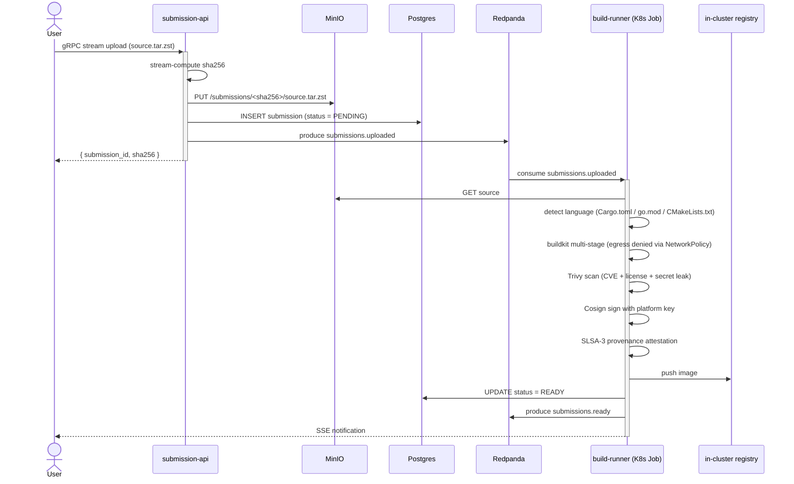
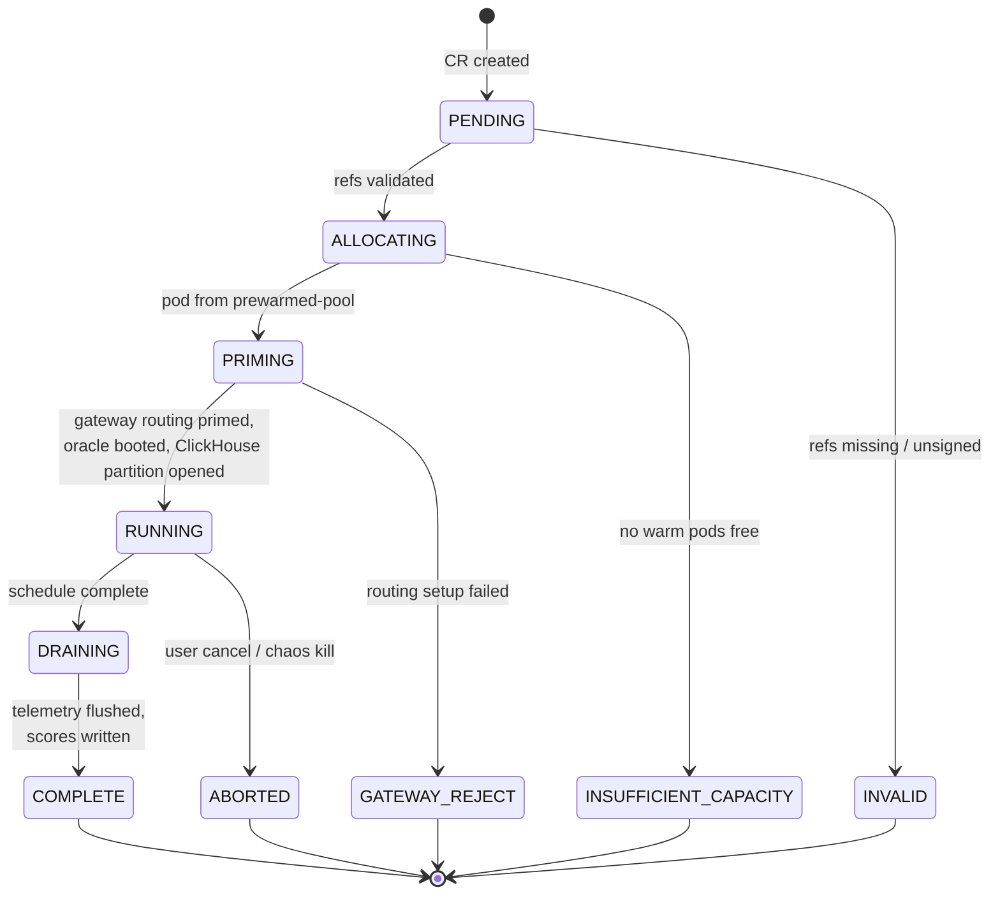
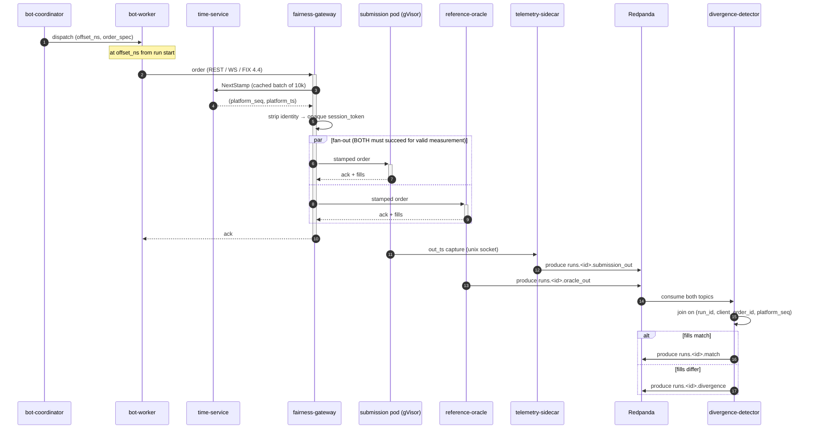
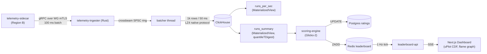
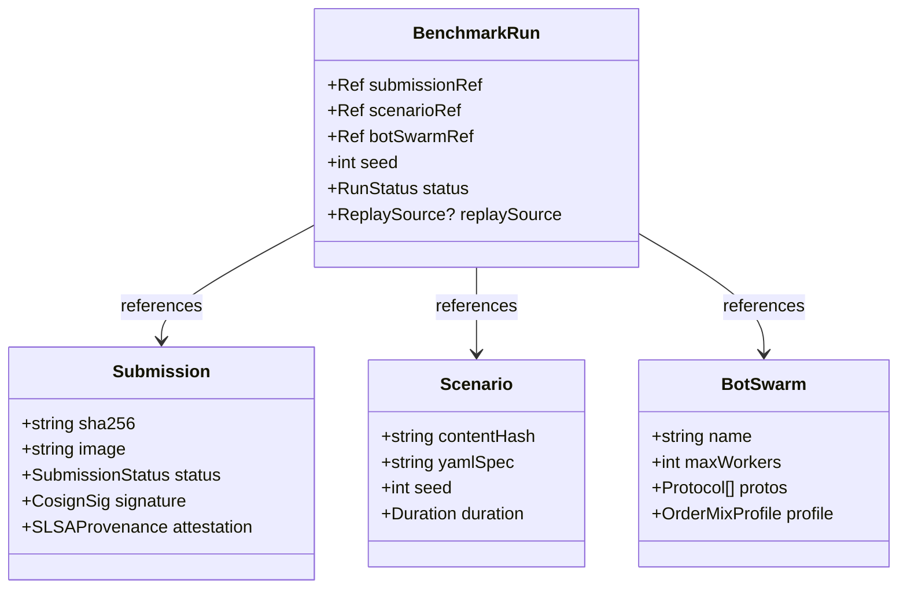

# IronBook — Distributed Benchmarking & Hosting Platform
## Design Specification

| Field | Value |
|---|---|
| **Status** | In progress — Sections 1–3 approved; 4–9 pending |
| **Author** | Kartik Mehra (solo) |
| **Hackathon** | IICPC Summer Hackathon 2026 (May 9 → June 10, 2026) |
| **Created** | 2026-05-10 |
| **Repo** | github.com/<owner>/IronBook |
| **Codename** | IronBook (order book + iron-clad correctness) |

---

## 0. Context

### 0.1 Problem statement (from organizer brief)

Architect and build a **Distributed Benchmarking and Hosting Platform** that evaluates contestant-submitted trading infrastructure (matching engines, order books, exchange APIs) written in C++, Rust, or Go. The platform must:

1. Accept code uploads.
2. Securely host submissions in isolated sandboxes with CPU pinning and strict memory limits.
3. Expose REST / WebSocket / FIX endpoints from each submission.
4. Spawn a distributed fleet of trading bots that bombard each submission with concurrent orders.
5. Capture latency (p50/p90/p99), throughput (TPS), and correctness (price-time priority, fill accuracy).
6. Stream live results to a dynamic leaderboard.

The judges have explicitly endorsed: **gRPC, Kafka/Redpanda, TimescaleDB/Redis, Terraform, Kubernetes manifests/Docker Swarm**. Deviations from these must be defended in this document.

Three deliverables, equal weight:

1. Working infrastructure prototype (Code Upload → Containerized Deployment → Distributed Load Testing → Real-Time Scoring).
2. **This document** (Architecture Blueprint).
3. Infrastructure as Code (Terraform + Kubernetes manifests).

### 0.2 Constraints

| Constraint | Value | Implication |
|---|---|---|
| Workforce | 1 person, beginner-to-intermediate | Pick fewer technologies, go deep |
| Calendar | 31 days (May 10 → June 10) | 25-day build + 6-day submission buffer |
| AI assistance | First 12 days only | Architectural climax must land by Day 12 |
| Hardware | macOS M3 Pro (ARM64) | No KVM → Firecracker out → gVisor in |
| Cloud budget | ~€10–50 / month | Single Hetzner CCX13 ARM VM |
| Submission format | Repo + working prototype + this doc + IaC | Reproducibility matters |

### 0.3 Strict priority order

1. **Correctness** — price-time priority, fill consistency, deterministic replay
2. **Throughput** — orders per second sustained
3. **Realistic exchange behavior** — order types, market regimes, FIX semantics

### 0.4 Final stack decisions

| Layer | Choice | Rationale (one-liner; full justification in §3 / §10) |
|---|---|---|
| Sandbox runtime | gVisor (runsc) + seccomp + AppArmor + cgroups v2 | KVM unavailable on Mac dev path; gVisor is production-grade (Cloud Run / App Engine) |
| Orchestration | k3d (Mac) + k3s (Hetzner) connected by Wireguard | Real K8s, two clusters, ~€10/mo total |
| CRDs | `Submission`, `Scenario`, `BenchmarkRun`, `BotSwarm` (kubebuilder) | Distinct lifecycles; teaches the K8s extension model |
| Hot path | Rust (matching-engine ref, telemetry-ingester, eBPF probes via `aya`) | Lock-free queueing, zero-cost abstractions |
| Control plane | Go (operator, gateway, fleet, validators) | K8s ergonomics, fastest learning curve |
| Streaming | Redpanda (Kafka API, single binary, tiered storage to MinIO) | No JVM, no Zookeeper, simpler ops |
| Time-series | ClickHouse (MergeTree + materialized views) | Faster ingestion than Timescale, friendlier SQL for histograms |
| Metadata | Postgres | Standard relational |
| Cache + leaderboard | Redis (sorted sets) | ZADD/ZRANGE for live ranking |
| Artifacts | MinIO (S3-compatible, content-addressed) | Replay logs, source archives, signed manifests |
| RPC | gRPC + Protobuf | IDL-driven, codegen for both Go and Rust |
| Wire to UI | gRPC-Web (control) + SSE (leaderboard delta stream) | SSE is lighter than WS for one-way fan-out |
| Frontend | Next.js 15 (App Router) + shadcn/ui + uPlot + TanStack Query | Modern React, real-time data viz |
| Observability | OpenTelemetry → Tempo + Loki + Prometheus + Grafana + Parca | Full o11y stack, eBPF profiling |
| IaC | Terraform (Hetzner + Cloudflare) + raw K8s manifests + Kustomize | Helm only after the abstraction earns its keep |
| GitOps | Argo CD watching `./deploy/manifests` | Real GitOps, big resume signal |
| CI/CD | GitHub Actions + Cosign image signing + Trivy + SLSA-3 attestations | Supply-chain hygiene |
| Admission | OPA Gatekeeper + custom admission-webhook | Two layers, distinct roles |

---

## 1. System Topology — APPROVED

A two-region architecture. Region A (Mac) is the **Control & Insight Plane**: stateful services, orchestration, observability, frontend. Region B (Hetzner) is the **Sandbox & Hot Path**: untrusted code execution, bot fleet, reference oracle, fairness gateway. Wireguard connects them; **the order hot path never crosses Wireguard**.

### 1.1 Architectural principles

1. **The hot path lives in one cluster.** A bot's order, the gateway's stamp, the submission's reply, the oracle's parallel reply — all intra-cluster in Region B. Cross-region latency would distort the very numbers we publish.
2. **Correctness is a stream-processing problem.** The reference oracle consumes the same deterministic input as the submission, in parallel; a divergence detector compares output tuple-by-tuple. The leaderboard surfaces correctness live, not in batch.
3. **Determinism comes from outside the submission.** Platform-issued monotonic timestamps + sequence numbers eliminate the "fast clock" attack and make scoring fair across hardware.
4. **Every component earns its keep.** Each box on the diagram has a load-bearing reason that is articulated in §3. No vanity services.

### 1.2 Topology diagram


### 1.3 What every new piece earns its keep

- **fairness-gateway** — stamps every order with a platform-issued `(platform_seq, platform_ts)`, strips bot identity, and **tees** every input to the reference oracle. One service, three load-bearing jobs.
- **reference-oracle** — your Rust matching engine running in parallel with the submission, fed the *exact same* gateway-stamped inputs. Its output is the ground truth.
- **time-service** — kills the "fast clock" attack. ~150 lines of Rust; pedagogical excuse to learn TSC, chrony, and exchange-grade timestamping.
- **prewarmed-pool** — cold-start jitter (200–500 ms) eats published p99 numbers. Four idle gVisor pods, swap in on `BenchmarkRun` create.
- **scenario-compiler + content-addressed scenarios** — every YAML scenario compiles to a deterministic event schedule with a seeded PRNG; the schedule is sha256-hashed; that hash is the scenario ID. Two runs with the same scenario ID get bit-identical input — that is what makes ranking comparable.
- **MinIO + Parquet replay logs** — every run captures its full input as a Parquet file, content-addressed. `replay-engine` re-emits any historical input against any submission. HFT-grade and rare in hackathons.
- **Redpanda tiered storage** — single broker, infinite retention via cold-segment offload to MinIO.
- **KEDA on Redpanda lag** — bot-fleet autoscales on `orders` topic consumer lag. Canonical "real distributed autoscaling" lesson.
- **OPA Gatekeeper + admission-webhook** — Gatekeeper for boring policies (no `:latest`, no privileged, no `hostPath`). Webhook for the interesting policy (every submission pod must use `runtimeClassName: gvisor`, must mount the readonly seccomp profile, must declare its CRD owner).
- **Argo CD** — `./deploy/manifests` is the source of truth. Day-to-day deploy = `git push`.
- **Glicko-2 scoring** — multi-scenario tournaments with rating ± deviation, not single-run-wins.
- **chaos-agent** — judge clicks "Inject Network Loss" → packet loss spikes → leaderboard shows resilient submissions stay green. Live theater, technically real.

### 1.4 Cross-region wire — what crosses, what doesn't

| Crosses Wireguard | Stays intra-cluster (Region B) |
|---|---|
| Telemetry batches (B → A Redpanda, ~5s aggregate) | **All order flow** (bot → gateway → submission) |
| OTel traces / metrics / logs (B → A collector) | Reference oracle parallel feed |
| Operator → k3s API control (A → B, mTLS over WG) | Divergence detection inputs |
| Argo CD reconcile poll (A → B git mirror) | eBPF observation stream |

### 1.5 Deliberately *not* in the topology

- **Service mesh (Istio / Linkerd).** ~12 services across 2 nodes; mesh overhead exceeds benefit. mTLS via cert-manager directly on each gRPC server.
- **Multi-cloud failover.** Documented as future work in §10.
- **Kafka.** Redpanda is API-compatible, single binary, no JVM, no Zookeeper.
- **A separate scheduler service.** The benchmark-operator *is* the scheduler. Adding another would be Conway's-Law cosplay.
- **WASM execution mode.** Mentioned as a runtime-class plug-point; not implemented.

---

## 2. Data Flow & Order Lifecycle — APPROVED

Five distinct flows. Each one self-contained: trigger, path, timing, invariants. Violating any invariant means the platform is *wrong*, not just slow.

### 2.1 Flow 1 — Submission upload (cold path)



**Invariants**

- Source artifact is content-addressed by sha256; identical uploads dedupe automatically.
- A submission can only transition `PENDING → BUILDING → READY` or `→ REJECTED`. No reverse transitions.
- Build runs in namespace `builds/` with NetworkPolicy denying all egress except the in-cluster registry. Hostile build-time code cannot phone home.
- An unsigned image is never schedulable. The admission-webhook checks the cosign signature on every pod create.

**Timing budget:** end-to-end upload-to-ready ≤ 90 s for typical Rust, ≤ 30 s for Go. Per-language buildkit cache lives on its own PV, persisted across runs.

### 2.2 Flow 2 — BenchmarkRun lifecycle (control path)



**Reconciler steps (RUNNING entry):**

1. Allocate a hot pod from `prewarmed-pool` (binary swap via `emptyDir` mount + container restart).
2. Issue ephemeral mTLS certs via cert-manager `Certificate` CR per run.
3. Configure `fairness-gateway` routing: `{ run_id → submission_endpoint, oracle_endpoint }`.
4. Boot reference-oracle pod with same `(scenario_hash, seed)`.
5. Compile scenario YAML → event schedule → push to bot-coordinator.
6. Open ClickHouse partition for this `run_id`.
7. Set `Status: RUNNING`; emit `run.started` event to Redpanda.

**Invariants**

- The fairness-gateway is primed *before* the first bot order is emitted. Orders arriving without a routing rule are rejected and counted.
- Oracle and submission boot from the same `(scenario_hash, seed)` — guaranteed identical input.
- Hot pods in the pre-warm pool already have the gVisor sandbox initialized; only the contestant binary is swapped. Cold start drops from ~400 ms to ~30 ms.

**Timing budget:** `BenchmarkRun.create → status = RUNNING` ≤ 800 ms (warm pod), ≤ 4 s (cold).

### 2.3 Flow 3 — Order hot path (latency-scored)

This is the path every published p50/p99 number is measured along. **Lives entirely intra-cluster in Region B. Never crosses Wireguard.**



**Invariants — checked, not assumed**

1. **Strict monotonicity of `platform_seq`** within a run. Any gap = error logged, run flagged.
2. **Every input is teed to both consumers.** The gateway maintains a per-run counter. If `submission_in_count ≠ oracle_in_count`, the run is invalidated.
3. **`client_order_id` is unique within a bot.** Coordinator generates them; gateway rejects duplicates.
4. **Reference oracle output is ground truth.** If oracle and submission disagree on fills for the same input, the submission is wrong by definition.
5. **Latency is measured at the gateway.** `latency_ns = t_ack_at_gateway − t_in_at_gateway`. The submission cannot fake low latency by lying about its own clock.

**Timing budget (published on the leaderboard)**

| Hop | Native | Under gVisor | Notes |
|---|---|---|---|
| bot-worker → gateway | 30–80 µs | n/a | bot-worker runs native |
| gateway stamp + fork | 10–30 µs | n/a | single Go alloc; sync.Pool reuse |
| gateway → submission (gVisor) | 50–150 µs | gVisor adds ~30 µs syscall overhead | published as part of submission's number |
| submission engine work | depends | depends | this is what the contestant is graded on |
| submission ack → telemetry-sidecar | 5–20 µs | n/a | unix socket; sidecar is native |
| telemetry → Redpanda | 100 ms batch | n/a | does NOT count toward order latency |
| divergence detection | ≤ 1 s lag | n/a | consumer lag, not order lag |

A submission processing simple limit orders in ~5 µs of engine work, served via WS, ought to land around **p50 ≈ 90 µs, p99 ≈ 250 µs** on this platform.

### 2.4 Flow 4 — Telemetry to leaderboard



**Invariants**

- The hot order path **never blocks** on telemetry. Sidecar's send queue has bounded capacity; on overflow it drops *and increments a counter*. We measure what we miss.
- ClickHouse inserts are at-least-once; idempotency comes from `(run_id, platform_seq)` as the dedup key.
- Leaderboard cadence is decoupled from telemetry cadence. ClickHouse can lag 200 ms without anyone noticing; the leaderboard ticks at 1 Hz independently.

### 2.5 Flow 5 — Deterministic replay

```mermaid
sequenceDiagram
    actor Judge
    participant API as submission-api
    participant Op as benchmark-operator
    participant Rep as replay-engine
    participant MN as MinIO
    participant GW as fairness-gateway
    participant Sub as new submission pod
    participant Or as reference-oracle

    Judge->>API: replay run R against submission Y
    API->>Op: create BenchmarkRun (replay_source = R_hash)
    Op->>Rep: prepare replay job
    Rep->>MN: GET parquet replay log
    Op->>Op: boot pods (sub + oracle), prime gateway
    Rep->>GW: re-emit orders (preserve original platform_seq, platform_ts)
    GW->>Sub: stamped order
    GW->>Or: stamped order
    Note over Sub,Or: identical input as the original run
    Sub-->>GW: ack + fills (NEW output)
    Or-->>GW: ack + fills (recomputed; should match original oracle)
    Note over Rep: scoring is comparable to original run
```

**Invariants**

- Replay never calls `time-service` for new stamps; it preserves the original `(platform_seq, platform_ts)` from the recorded log. This is what makes A-vs-B fair.
- A replay log is content-addressed by sha256 of its serialized event stream.
- A self-replay (same submission image sha256 against the log it was recorded with) **must** produce byte-identical output. CI asserts this as a smoke test.

### 2.6 Out-of-scope flows

- **Saga / compensating transactions** for `BenchmarkRun` failures. Operator deletes the CR and frees the pod. No external side effects yet.
- **Exactly-once Redpanda semantics.** Idempotent producers + consumer-side dedup keys are sufficient.
- **Distributed transactions across Postgres + ClickHouse.** Postgres holds metadata; ClickHouse holds time-series. They are never updated atomically; run metadata flips to `COMPLETE` only after final telemetry batch flush is confirmed.

---

## 3. Component Specifications — APPROVED

### 3.1 Service inventory

| # | Service | Lang | Region | LoC est. | Watches CRD | Stateless | Why it exists |
|---|---|---|---|---|---|---|---|
| 1 | `submission-api` | Go | A | ~1.5k | Submission (writer) | Yes | Authenticated upload, content-addressed, multipart→MinIO |
| 2 | `benchmark-operator` | Go (kubebuilder) | A | ~2.5k | All 4 | Yes | The brain: reconciles BenchmarkRun → pods + routing |
| 3 | `scenario-compiler` | Go | A | ~600 | Scenario | Yes | YAML DSL → seeded deterministic event schedule |
| 4 | `scoring-engine` | Go | A | ~700 | — | Yes | Glicko-2 across scenarios, composite score |
| 5 | `admission-webhook` | Go | A | ~400 | — | Yes | Enforces gVisor + read-only + dropped caps on every pod |
| 6 | `build-runner` | Go (Job) | A | ~800 | Submission (builder) | Per-job | Sandboxed buildkit + Trivy + Cosign + SLSA |
| 7 | `telemetry-ingester` | Rust | A | ~900 | — | Yes | Lock-free SPSC → ClickHouse batch insert |
| 8 | `divergence-detector` | Rust | A | ~700 | — | Kafka-checkpointed | Joins oracle vs submission output |
| 9 | `replay-engine` | Rust | A | ~600 | — | Yes | Parquet → re-emit orders against any sandbox |
| 10 | `leaderboard-api` | Go | A | ~600 | — | Yes | 1 Hz Redis ZRANGE → SSE |
| 11 | Frontend | TS / Next.js | A | ~3k | — | n/a | Live leaderboard, latency CDF, flame graphs |
| 12 | `fairness-gateway` | Go | B | ~700 | — | Yes | Stamps platform_seq, strips identity, tees to oracle |
| 13 | `reference-oracle` | Rust | B | ~2k | — | Per-run | The matching engine; ground truth |
| 14 | `bot-coordinator` | Go | B | ~600 | BotSwarm | Per-run | Reads schedule, dispatches events |
| 15 | `bot-worker` | Rust | B | ~900 | — | HPA-scaled | REST/WS/FIX clients |
| 16 | `telemetry-sidecar` | Rust | B | ~500 | — | Per-pod | Captures (in_ts, out_ts, order, ack, fills) |
| 17 | `time-service` | Rust | B | ~250 | — | Yes | Monotonic ns, chrony-corrected |
| 18 | `ebpf-observer` | Rust (aya) | B | ~400 | — | DaemonSet | Per-cgroup syscalls / CPU / net |
| 19 | `chaos-agent` | Go | B | ~300 | — | Yes | Pod kill, tc netem, cgroup CPU throttle |

**Totals:** ~17k LoC; ~4k Rust, the rest Go + TS.

**Shared crates / packages**

- `crates/matching-engine` (Rust) — order book + matcher, used by `reference-oracle` and as the publishable contestant template
- `crates/replay-format` (Rust) — Parquet schema + (de)serializer
- `crates/telemetry-proto` (proto) — generated Go + Rust bindings
- `pkg/k8s-client` (Go) — thin wrapper on client-go
- `pkg/cosign-verify` (Go) — cosign sig verification

### 3.2 Custom Resource model



### 3.3 Deep-dive: `benchmark-operator`

Reconciles 4 CRDs. Built with `kubebuilder` v4. Single binary, leader-elected (1 active + 2 standby on a 3-node k3d cluster).

```
controllers/
  submission_controller.go     # PENDING → BUILDING → READY
  scenario_controller.go       # validate + content-address scenario YAML
  bot_swarm_controller.go      # provision a named, reusable bot fleet config
  benchmark_run_controller.go  # the main reconciler (most complex)
```

`BenchmarkRunReconciler.Reconcile()` is the state machine in §2.2. Each transition is idempotent — operator can restart mid-reconcile and resume. `kubectl describe BenchmarkRun` surfaces status conditions; a judge running `kubectl get br -w` sees the state machine update live.

**Critical invariants**

- Operator never creates a pod without a corresponding `Submission` in `READY` status.
- Operator never marks `COMPLETE` until `telemetry-ingester` confirms final batch flush via Redpanda topic `runs.<id>.flushed`.
- Operator owns the lifecycle of run-scoped TLS certs (cert-manager `Certificate` CR per run).
- `OwnerReferences` cascade: deleting a `BenchmarkRun` garbage-collects its pods, certs, and ClickHouse partition.

### 3.4 Deep-dive: `fairness-gateway`

Stateless Go gRPC + HTTP/2 + WebSocket + FIX 4.4 proxy. All four wire formats normalize internally to a `NormalizedOrder` proto.

```go
// Hot-path pseudocode
func (g *Gateway) HandleOrder(ctx context.Context, raw []byte, proto Protocol) error {
    order := decode(raw, proto)                      // ~200 ns
    seq, ts := g.timeClient.NextStamp()              // ~5 µs (cached batch)
    order.PlatformSeq = seq
    order.PlatformTs = ts
    order.SessionToken = g.opaqueToken(order.BotID)  // strip identity

    // FAN-OUT (key correctness invariant)
    err1 := g.submissionConn.SendAsync(order)        // gVisor pod
    err2 := g.oracleConn.SendAsync(order)            // native pod
    if err1 != nil || err2 != nil {
        return fmt.Errorf("tee failed: %w / %w", err1, err2)
    }

    g.sidecarHook.OnIn(order)                        // unix socket → sidecar
    return nil
}
```

**Critical design choices**

- Single allocation per request (`sync.Pool` for `NormalizedOrder`, decoder reuse).
- `time-service` calls are **batched**: the gateway fetches 10,000 stamps at a time and serves them locally, amortizing the RPC.
- Fan-out is fire-and-forget at the wire level, but ack is awaited from *both* targets before the bot sees a response. This is what makes "oracle disagreed = run invalid" honest.

### 3.5 Deep-dive: `reference-oracle`

A real Rust matching engine. The single most valuable artefact you build the whole hackathon — it teaches order books, lock-free structures, async Rust, property-based testing, and gives you the correctness oracle that makes the platform credible.

```
crates/matching-engine/
  src/
    book.rs           # OrderBook: BTreeMap<Price, VecDeque<Order>> per side
    match.rs          # price-time priority matcher → Vec<Fill>
    types.rs          # Order, Fill, Side, OrderType, TimeInForce
    sequence.rs       # monotonic event log
    snapshot.rs       # deterministic serialization (replay support)
  tests/
    proptest.rs       # property: any order sequence → consistent fills
    examples.rs       # hand-written scenarios from real exchange patterns
  benches/
    throughput.rs     # criterion bench, target: 1M orders/sec single-thread
```

**Properties checked with `proptest`**

1. **No-free-lunch:** total quantity in fills = total matched quantity on both sides.
2. **Price-time priority:** for any fill at price P from side `Bid`, no resting `Ask` at price ≤ P with earlier `platform_seq` was unfilled before it.
3. **Idempotency:** applying the same `(platform_seq, order)` twice produces the same book state.
4. **Determinism:** serialize the book, deserialize, reapply remaining events → identical state.

Wire layer: oracle pod wraps the engine in a thin gRPC server mirroring the submission's expected API. Same protocol, same wire format — so the fairness-gateway treats them identically.

### 3.6 Deep-dive: `telemetry-ingester`

Three-thread design, deliberately simple:

```
[ gRPC server thread ]──▶ SPSC ring (crossbeam) ──▶[ batcher ]──▶[ ClickHouse client ]
   1 conn per region        bounded; drop on full      1k rows /         native protocol,
   ~10k events/s typ        counter incremented        50 ms             LZ4 wire compression
```

**Design choices**

- **SPSC, not MPSC:** one upstream producer per ingester instance.
- **Drop on full, not block:** if ClickHouse is slow, we do *not* back-pressure into the gateway. We measure dropped events.
- **ClickHouse native protocol:** order-of-magnitude better insertion than HTTP.
- **LZ4 over the wire**, **zstd at rest** in MergeTree.

### 3.7 Deep-dive: `divergence-detector`

Stream-processing service. Consumes `submission_out` and `oracle_out`, joins on `(run_id, client_order_id, platform_seq)`, emits divergences.

**Join state:** fixed-size LRU keyed by `platform_seq`, sized to ~10 s of throughput. Match-within-window → emit *match*; window expiry without match → emit *missing*; content disagreement → emit *content_divergence*.

**Why custom, not Flink / Kafka Streams:** ~500 lines of Rust does exactly this and nothing else. Dragging a stream-processing framework in for one join is the wrong resume signal.

### 3.8 Deep-dive: `replay-engine`

Reads Parquet input log from MinIO, re-emits via fairness-gateway with original `(platform_seq, platform_ts)` preserved. This is what makes "submission A and submission B faced the same market conditions" defensible.

**Two modes**

- **Faithful:** reuse original ts and seq exactly. Used for A/B comparison.
- **Realtime:** shift ts to now, regenerate seq. Used for live demo of historical scenarios.

**Critical invariant:** in faithful mode, the platform refuses to start replay if the target submission's container image sha256 matches the original recording target — a self-replay must be byte-identical, asserted in CI.

### 3.9 Communication matrix

| From → To | Wire | Auth | Sync |
|---|---|---|---|
| Browser → Caddy | TLS (Cloudflare) | CF Access JWT → app JWT | Sync |
| Frontend → submission-api | gRPC-Web | App JWT | Sync |
| Frontend → leaderboard-api | SSE | App JWT | Stream |
| submission-api → MinIO | S3 | k8s Secret creds | Sync |
| submission-api → Postgres | postgres wire | mTLS | Sync |
| submission-api → Redpanda | Kafka API | mTLS + SASL | Async |
| benchmark-operator → k3s API (A) | k8s API | ServiceAccount | Sync |
| benchmark-operator → k3s API (B, over WG) | k8s API | mTLS + WG | Sync |
| bot-worker → fairness-gateway | HTTP/2 + WS + FIX | mTLS (cert-manager run cert) | Sync |
| fairness-gateway → submission pod | HTTP/2 / WS / TCP | mTLS | Sync |
| fairness-gateway → reference-oracle | gRPC | mTLS | Sync |
| fairness-gateway → time-service | gRPC long-poll | mTLS | Sync |
| telemetry-sidecar → Redpanda (over WG) | Kafka API | mTLS | Async |
| telemetry-ingester → ClickHouse | CH native | mTLS | Sync (batched) |
| divergence-detector → Redpanda | Kafka API | mTLS | Async |
| scoring-engine → Redis | RESP3 | ACL + TLS | Sync |
| leaderboard-api → Redis | RESP3 | ACL + TLS | Sync |
| ebpf-observer → OTel collector | OTLP/gRPC | mTLS | Async |
| OTel collector → Tempo / Loki / Prom | OTLP / native | local | Async |
| Argo CD → git → cluster | git+ssh, k8s API | deploy key + SA | Reconcile |

mTLS is automated end-to-end via **cert-manager** with a self-hosted CA. No human ever touches a cert.

### 3.10 State ownership matrix

| State | Owner | Readers | Notes |
|---|---|---|---|
| User accounts | Postgres `users` | submission-api, leaderboard-api | bcrypt + per-user JWT |
| Submission metadata | Postgres `submissions` | submission-api, operator, frontend | Status state-machine enforced |
| Submission source / binary | MinIO (sha256-addressed) | build-runner, operator | Immutable once written |
| Scenario YAML | Postgres + content-addressed in MinIO | scenario-compiler, operator | Immutable once content-addressed |
| Compiled scenario schedule | MinIO (sha256-addressed) | bot-coordinator, replay-engine | Deterministic, regenerable |
| Run lifecycle | k8s CRD `BenchmarkRun.Status` | Everyone via watch | Single writer: operator |
| Run input log (replay) | MinIO Parquet (sha256-addressed) | replay-engine, divergence-detector | Append-only during run, sealed at COMPLETE |
| Telemetry events | ClickHouse `runs_raw` | telemetry-ingester (writer), leaderboard-api, scoring-engine | TTL 7d on raw |
| Run summary stats | ClickHouse `runs_summary` MV | scoring-engine, frontend | Computed incrementally |
| Glicko ratings | Postgres `ratings` | scoring-engine (writer), leaderboard-api | Updated after every COMPLETE |
| Live leaderboard | Redis ZSET `leaderboard:<scenario_id>` | scoring-engine (writer), leaderboard-api | Rebuildable from Postgres |
| Run-scoped TLS certs | cert-manager → k8s Secret | gateway, submission, oracle | Auto-rotated, owner-ref scoped |

### 3.11 Restart and scaling rules

| Service | If it crashes | Scaling axis | Limits |
|---|---|---|---|
| submission-api | Stateless restart, reconnect | HPA on QPS, 2–6 replicas | Postgres conn pool |
| benchmark-operator | Leader election re-runs, standby takes over | 3 replicas, 1 active | Single-writer per CRD |
| fairness-gateway | Stateless restart; bots retry | One per submission pod | Co-located for cache locality |
| reference-oracle | Restart from snapshot if seqno preserved; else run invalidated | One per run | Per-run isolation |
| bot-coordinator | Resume from last emitted offset (deterministic event log) | One per run | — |
| bot-worker | Restart, take next claim from Redpanda | KEDA on `orders` consumer lag | Capped at `BotSwarm.spec.maxWorkers` |
| telemetry-sidecar | Local buffer up to 5 MB; on crash, lost events counted | One per submission pod | Drop policy explicit |
| telemetry-ingester | SPSC drains, restart picks up via Kafka offset | 1 per region; vertical scale | ClickHouse insert throughput |
| divergence-detector | Resume from Kafka offset, rebuild join window | 1 per shard | Window = 10s of throughput |
| scoring-engine | Stateless, recompute on boot | 1 instance | Idempotent on rerun |
| leaderboard-api | Stateless restart | HPA on SSE connection count | — |
| time-service | Stateless; chrony recovers | 1 per region | ts must be monotonic across restart (persisted high-watermark) |
| ClickHouse / Postgres / Redis / MinIO | StatefulSet with PVC | Vertical first; sharding documented as future | Single-node intentional |
| Redpanda | StatefulSet, single broker, tiered storage | Vertical first | "How we'd scale to 3 brokers" in §10 |

---

## 4. Security & Sandbox Model — PENDING

> *To be filled after user approval. Planned subsections:*
>
> 4.1 Threat model (untrusted contestant code, hostile bots, hostile clients, supply-chain)
> 4.2 Defense-in-depth layers (gVisor + seccomp + AppArmor + cgroups + NetworkPolicy + OPA + admission-webhook)
> 4.3 Supply-chain security (Cosign signing, SLSA-3 attestations, Trivy scans, distroless base images)
> 4.4 Secrets management (cert-manager, k8s Secrets encrypted at rest, sealed-secrets in git)
> 4.5 IAM / RBAC (per-CRD RBAC, ServiceAccount per service, no cluster-admin in runtime path)
> 4.6 Anti-cheat (egress denial, identity stripping at gateway, syscall budget via eBPF, image-pinning)
> 4.7 Audit logging (compliance-grade event log, immutable in ClickHouse + MinIO archival)

---

## 5. Correctness & Replay Engine — PENDING

> *Planned subsections:*
>
> 5.1 Correctness invariants (price-time priority, fill consistency, no phantom fills)
> 5.2 Reference oracle as ground truth
> 5.3 Live divergence detection
> 5.4 Deterministic replay format (Parquet schema, content addressing)
> 5.5 Replay-driven A/B comparison
> 5.6 Self-replay byte-equality CI gate

---

## 6. Observability & Scoring — PENDING

> *Planned subsections:*
>
> 6.1 OpenTelemetry pipeline (traces / metrics / logs)
> 6.2 Per-order distributed traces (bot → gateway → submission → ack)
> 6.3 Histograms (per-symbol, per-side, per-order-type)
> 6.4 Continuous profiling (Parca, eBPF-backed)
> 6.5 ClickHouse schema (runs_raw, runs_per_sec, runs_summary)
> 6.6 Composite scoring formula
> 6.7 Glicko-2 rating across scenarios
> 6.8 Anti-cheat scoring signals

---

## 7. Testing Strategy — PENDING

> *Planned subsections:*
>
> 7.1 Unit tests (per crate / per package)
> 7.2 Property-based tests (matching engine via proptest)
> 7.3 Integration tests (Testcontainers for Redpanda / Postgres / ClickHouse)
> 7.4 End-to-end tests (kind cluster + sample submissions)
> 7.5 Chaos suite (chaos-agent driven)
> 7.6 CI gates (self-replay byte-equality, image signing, Trivy clean)

---

## 8. Failure Modes & Error Handling — PENDING

> *Planned subsections:*
>
> 8.1 Submission-side failures (crash, hang, OOM, syscall denial)
> 8.2 Platform-side failures (gateway crash, oracle crash, telemetry loss)
> 8.3 Network partition (WG flap, intra-cluster DNS)
> 8.4 Stateful-store failures (CH down, PG down, MinIO down, Redis down)
> 8.5 Operator restart and reconciliation safety
> 8.6 Backpressure rules (drop > block on the hot path)

---

## 9. Repo Structure & IaC Layout — PENDING

> *Planned subsections:*
>
> 9.1 Monorepo layout (apps/, crates/, deploy/, docs/, tools/)
> 9.2 Go module organization
> 9.3 Rust workspace
> 9.4 Terraform module structure (Hetzner, Cloudflare)
> 9.5 K8s manifests with Kustomize overlays (dev / prod)
> 9.6 GitHub Actions CI/CD pipelines
> 9.7 Argo CD application set
> 9.8 Demo runbook

---

## 10. Future Work — PENDING

> *To be expanded; placeholder list:*
>
> - Firecracker microVM runtime class (when bare-metal is available)
> - Multi-region cloud with DNS failover
> - WASM execution mode for ironclad cross-arch isolation
> - Service mesh (Linkerd preferred over Istio) at >50 services
> - Sharded Redpanda + ClickHouse for >100k orders/sec
> - ML-based anomaly detection on order flow

---

## Appendix A — 25-day execution plan

| Block | Days | Theme |
|---|---|---|
| Sandbox Week | 1–6 | Submission pipeline + gVisor + cgroups + k3s on Hetzner |
| Distributed Week | 7–12 | k3d on Mac, Wireguard, operator, gRPC, Redpanda, bot fleet — **Day 12 = Claude cutoff** |
| Telemetry & Replay Week | 13–18 | ClickHouse, OpenTelemetry, leaderboard, deterministic replay |
| Hardening & Blueprint Week | 19–23 | Chaos, anti-cheat, admission webhook, this document finalized |
| Polish + Demo | 24–25 | Benchmark charts, demo video, README |
| Submission buffer | 26–31 | Bug fixes, dry runs, hand-in |

## Appendix B — Glossary

| Term | Meaning |
|---|---|
| **platform_seq** | Monotonic per-run sequence number, stamped by fairness-gateway from time-service |
| **platform_ts** | Monotonic ns timestamp from time-service (chrony-corrected, TSC-derived) |
| **scenario_hash** | sha256 of compiled scenario schedule |
| **content-addressed** | Identified by sha256 of payload; immutable |
| **fairness-gateway** | Stateless proxy that stamps, strips identity, tees to oracle |
| **reference-oracle** | Our Rust matching engine running parallel to submission as ground truth |
| **divergence event** | Output of divergence-detector when oracle and submission disagree |
| **prewarmed-pool** | Idle gVisor pods kept hot to eliminate cold-start jitter |
| **runtimeClassName: gvisor** | K8s annotation that forces runsc as the container runtime |

